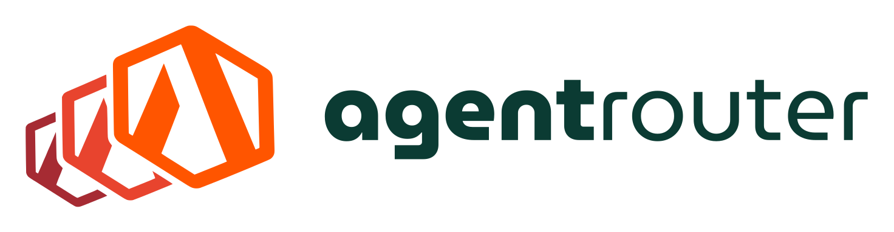

<p align="center">
  <a href="https://theagentrouter.ai">
    <picture>
      <source media="(prefers-color-scheme: dark)" srcset="site/static/img/brand/ar-horizontal-on-dark.svg">
      
    </picture>
  </a>
</p>

<p align="center">
  <b>The open source control plane for AI and agent traffic, powered by Envoy.</b><br>
  An Agentic AI Foundation project. Formerly <i>Envoy AI Gateway</i>.
</p>

<p align="center">
  <a href="https://theagentrouter.ai/docs">Documentation</a> ·
  <a href="https://theagentrouter.ai/docs/getting-started/">Quickstart</a> ·
  <a href="https://theagentrouter.ai/blog">Blog</a> ·
  <a href="https://theagentrouter.ai/release-notes/">Release Notes</a> ·
  <a href="https://theagentrouter.ai/talks">Talks</a>
</p>

# Agent Router

Agent Router gives application teams one consistent, OpenAI-compatible API for every model and tool, from hosted providers to self-hosted inference and MCP servers. Platform teams keep credentials, routing, quotas, failover, and usage attribution in one place, enforced by [Envoy](https://envoyproxy.io) and [Envoy Gateway](https://gateway.envoyproxy.io).

**Agent Router controls. Envoy carries.**

## Formerly Envoy AI Gateway

Envoy AI Gateway is now **Agent Router**, an Agentic AI Foundation project. Same code, same maintainers, same release cadence and Apache 2.0 license. Nothing you deploy is renamed:

- **CRDs and API group are unchanged**: `AIGatewayRoute`, `AIServiceBackend`, `BackendSecurityPolicy`, and the `aigateway.envoyproxy.io` API group stay as they are.
- **The CLI is still `aigw`**, and the `envoy-ai-gateway-system` namespace is unchanged.
- **Container images, Helm charts, and the Go module path are unchanged** (`docker.io/envoyproxy/ai-gateway-*`, `github.com/envoyproxy/ai-gateway`).
- **The repository moved** to [`theagentrouter/agent-router`](https://github.com/theagentrouter/agent-router); old `envoyproxy/ai-gateway` links redirect.
- **The website moved** to [theagentrouter.ai](https://theagentrouter.ai); every `aigateway.envoyproxy.io` link redirects to the same page.

Your manifests from yesterday apply tomorrow.

## Quick start

Run Agent Router as a standalone, OpenAI-compatible router on your laptop with one command:

```shell
OPENAI_API_KEY=sk-your-key aigw run
```

Then point any OpenAI-compatible client at `http://localhost:1975/v1`. See the [CLI guide](https://theagentrouter.ai/docs/cli/) for installation and provider auto-configuration, or the [Getting Started guide](https://theagentrouter.ai/docs/getting-started/) to deploy on Kubernetes with Envoy Gateway.

## Usage

When using Agent Router, we refer to a two-tier gateway pattern. **The Tier One Gateway** functions as a centralized entry point, and the **Tier Two Gateway** handles ingress traffic to a self-hosted model serving cluster.

- The **Tier One Gateway** handles authentication, top-level routing, and global rate limiting
- The **Tier Two Gateway** provides fine-grained control over self-hosted model access, with endpoint picker support for LLM inference optimization.


## Supported AI Providers

Agent Router supports a wide range of AI providers, making it easy to integrate with your preferred LLM services:

<div align="center">
  <table>
    <tr>
      <td align="center" width="120">
        
        <br><sub><b>OpenAI</b></sub>
      </td>
      <td align="center" width="120">
        
        <br><sub><b>Azure OpenAI</b></sub>
      </td>
      <td align="center" width="120">
        
        <br><sub><b>Google Gemini</b></sub>
      </td>
      <td align="center" width="120">
        
        <br><sub><b>Vertex AI</b></sub>
      </td>
      <td align="center" width="120">
        
        <br><sub><b>AWS Bedrock</b></sub>
      </td>
    </tr>
    <tr>
      <td align="center" width="120">
        
        <br><sub><b>Mistral</b></sub>
      </td>
      <td align="center" width="120">
        
        <br><sub><b>Cohere</b></sub>
      </td>
      <td align="center" width="120">
        
        <br><sub><b>Groq</b></sub>
      </td>
      <td align="center" width="120">
        
        <br><sub><b>Together AI</b></sub>
      </td>
      <td align="center" width="120">
        
        <br><sub><b>DeepInfra</b></sub>
      </td>
    </tr>
    <tr>
      <td align="center" width="120">
        
        <br><sub><b>DeepSeek</b></sub>
      </td>
      <td align="center" width="120">
        
        <br><sub><b>Hunyuan</b></sub>
      </td>
      <td align="center" width="120">
        
        <br><sub><b>SambaNova</b></sub>
      </td>
      <td align="center" width="120">
        
        <br><sub><b>Grok</b></sub>
      </td>
      <td align="center" width="120">
        
        <br><sub><b>Tetrate Agent Router Service</b></sub>
      </td>
    </tr>
    <tr>
      <td align="center" width="120">
        
        <br><sub><b>Anthropic</b></sub>
      </td>
    </tr>
  </table>
</div>

## Documentation

- [Documentation](https://theagentrouter.ai/docs) for Agent Router.
- [Quickstart](https://theagentrouter.ai/docs/getting-started/) to use Agent Router in a few simple steps.
- [CLI guide](https://theagentrouter.ai/docs/cli/) to run Agent Router standalone with `aigw run`.
- [Concepts](https://theagentrouter.ai/docs/concepts/) to understand the architecture and resources of Agent Router.
- [Blog](https://theagentrouter.ai/blog) for announcements, features, and reference architectures.
- [Talks and Presentations](https://theagentrouter.ai/talks) about Agent Router.

## Contact

- Chat: join the [Agent Router Discord][Discord] to ask questions and collaborate with the community.
- Weekly meeting: the maintainers and community meet every Monday. Register, add agenda points, and get involved via the [public meeting document][meeting].

## Get Involved

We follow the LF Projects [Code of Conduct][Code of conduct], as an Agentic AI Foundation project.

To contribute to the project via pull requests, please read the [CONTRIBUTING.md](CONTRIBUTING.md) file which includes information on how to build and test the project.

## Background

The proposal of using Envoy Gateway as a [Cloud Native LLM Gateway][Cloud Native LLM Gateway] inspired the initiation of this project.

---

Agent Router is an Agentic AI Foundation project, powered by Envoy. Copyright © Agent Router a Series of LF Projects, LLC. For web site terms of use, [trademark policy](https://theagentrouter.ai/trademark-policy) and other project policies please see <https://lfprojects.org>.

[meeting]: https://docs.google.com/document/d/10e1sfsF-3G3Du5nBHGmLjXw5GVMqqCvFDqp_O65B0_w/edit?tab=t.0
[Discord]: https://discord.gg/xuxtPq43gZ
[Code of conduct]: CODE_OF_CONDUCT.md
[Cloud Native LLM Gateway]: https://docs.google.com/document/d/1FQN_hGhTNeoTgV5Jj16ialzaSiAxC0ozxH1D9ngCVew/edit?tab=t.0#heading=h.uuu99yemq4eo
