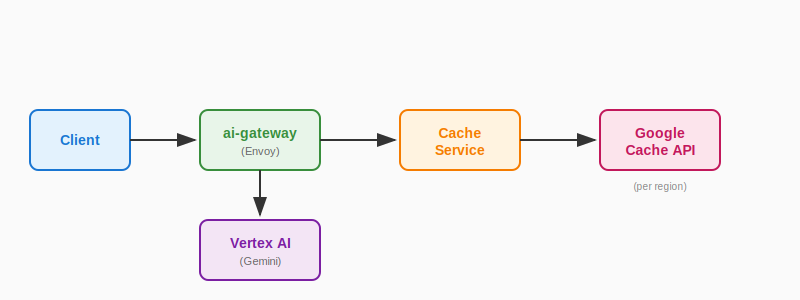
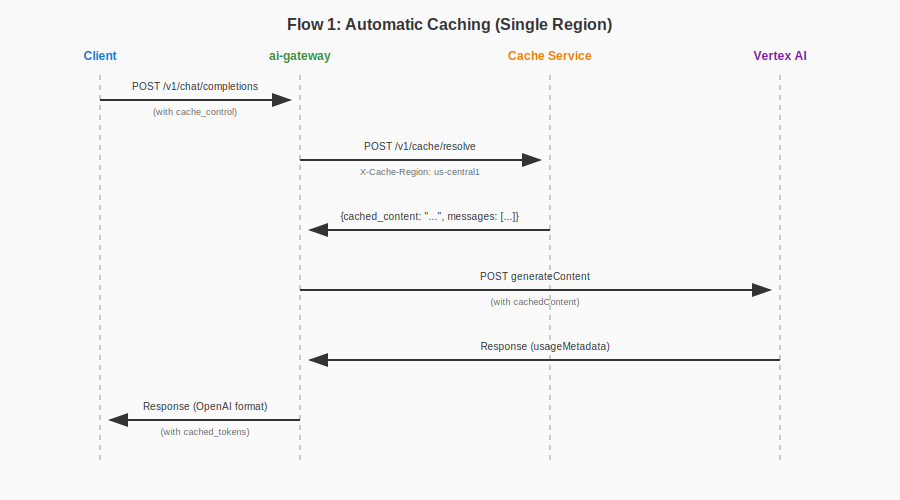
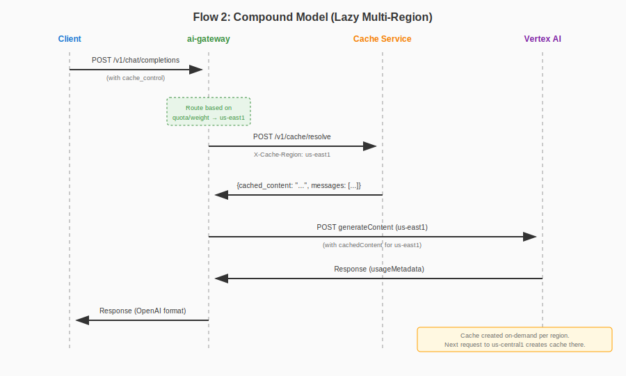

# Context Caching Support for GCP Vertex AI

## Table of Contents

<!-- toc -->

- [Summary](#summary)
- [Background](#background)
- [Architecture](#architecture)
- [Schema Extensions](#schema-extensions)
- [Cache Service API](#cache-service-api)
- [Request Flow](#request-flow)
- [Multi-Region Caching](#multi-region-caching)
- [Token Metrics](#token-metrics)
- [Error Handling](#error-handling)
- [Manual Cache Warming](#manual-cache-warming)
- [Future Enhancements](#future-enhancements)

<!-- /toc -->

## Summary

This proposal introduces context caching support for GCP Vertex AI (Gemini) in the Envoy AI Gateway. Context caching allows users to cache large, frequently-used content (system prompts, documents, few-shot examples) to reduce costs and latency on subsequent requests.

The implementation introduces:

1. A new external cache service that manages Google's `cachedContents` API
2. Schema extensions to support cache markers on messages and explicit cache names
3. Integration with the existing ai-gateway translation pipeline
4. Multi-region cache support for compound models

## Background

GCP Vertex AI provides a [Context Caching API](https://cloud.google.com/vertex-ai/docs/context-cache/context-cache-overview) that allows caching input tokens for reuse across multiple requests. Cached tokens are billed at a reduced rate (~25% of standard input token price), making this valuable for:

- Large system prompts
- Few-shot examples
- Retrieved documents (RAG)
- Long conversation prefixes

**Constraints:**

- Cached content must be a contiguous block of messages
- Cached content always appears as a prefix (before non-cached messages)
- Minimum token threshold applies (varies by model, see [GCP documentation](https://cloud.google.com/vertex-ai/docs/context-cache/context-cache-overview) for model-specific limits)
- Cache has a TTL (GCP default is 1 hour; this proposal defaults to 5 minutes for shorter-lived conversation caches)
- **Cache is regional** - a cache created in `us-central1` cannot be used from `us-east1`

## Architecture



**Components:**

1. **ai-gateway (Envoy)**: Receives OpenAI-format requests, detects cache markers, routes to a backend (region already selected), calls cache service with the selected region, translates to Gemini format with `cachedContent` field.

2. **Cache Service**: External HTTP microservice that:
   - Receives messages marked for caching and target region
   - Generates a deterministic cache key from content
   - Checks if cache exists in the region (via Google API)
   - Creates cache if it doesn't exist
   - Returns cache name and filtered messages

## Schema Extensions

### Request: Cache Control on Messages

Reuse the existing `cache_control` field on message content items (Anthropic-style):

```json
{
  "model": "gemini-1.5-pro",
  "messages": [
    {
      "role": "system",
      "content": [
        {
          "type": "text",
          "text": "You are a helpful assistant with extensive knowledge...",
          "cache_control": {
            "type": "ephemeral",
            "ttl": "3600s"
          }
        }
      ]
    },
    {
      "role": "user",
      "content": "What is quantum computing?"
    }
  ]
}
```

**Cache Control Fields:**
| Field | Type | Description |
|-------|------|-------------|
| `type` | string | Must be `"ephemeral"` |
| `ttl` | string | Optional. Cache TTL in seconds format (e.g., `"3600s"`). Defaults to 5 minutes (`"300s"`). |

**Rules:**

- Find the **last** message with `cache_control` - this is the cache breakpoint
- Everything from the beginning up to and including the breakpoint is cached
- Everything after the breakpoint is sent as non-cached content
- Only one cache breakpoint is used per request (the last marker wins)
- The TTL from the breakpoint message is used for the cache (if multiple markers have different TTLs, the last one wins)

**Cache Prefix:**

Following Anthropic's semantics, caching references the full prefix - `tools`, `system`, and `messages` (in that order) up to and including the block designated with `cache_control`.

For example:

- `cache_control` on a user message → caches: tools + system + messages up to that point
- `cache_control` on system → caches: tools + system

Place `cache_control` on the last item you want included in the cache. As conversations grow, moving the marker to a later message creates a new, larger cache.

**Example: Cache breakpoint**

```json
{
  "messages": [
    { "role": "system", "content": [{ "type": "text", "text": "..." }] },
    { "role": "user", "content": [{ "type": "text", "text": "..." }] },
    { "role": "assistant", "content": "..." },
    {
      "role": "user",
      "content": [
        {
          "type": "text",
          "text": "...",
          "cache_control": { "type": "ephemeral" }
        }
      ]
    },
    { "role": "assistant", "content": "..." },
    { "role": "user", "content": "Latest question" }
  ]
}
```

Result:

- Messages 0-3 are cached (everything up to and including the last `cache_control` marker)
- Messages 4-5 are sent as non-cached content

**Example: Growing conversation**

Turn 1 - cache system prompt and context:

```json
{
  "messages": [
    {
      "role": "system",
      "content": [
        {
          "type": "text",
          "text": "...",
          "cache_control": { "type": "ephemeral" }
        }
      ]
    },
    { "role": "user", "content": "First question" }
  ]
}
```

→ Cache: message 0 | Non-cached: message 1

Turn 3 - extend cache to include conversation history:

```json
{
  "messages": [
    { "role": "system", "content": [{ "type": "text", "text": "..." }] },
    { "role": "user", "content": "First question" },
    { "role": "assistant", "content": "First answer" },
    {
      "role": "user",
      "content": [
        {
          "type": "text",
          "text": "Second question",
          "cache_control": { "type": "ephemeral" }
        }
      ]
    },
    { "role": "assistant", "content": "Second answer" },
    { "role": "user", "content": "Third question" }
  ]
}
```

→ Cache: messages 0-3 (new cache created) | Non-cached: messages 4-5

### Request: Explicit Cache Name (Pre-cached Content)

Extend `GCPVertexAIVendorFields` to support explicit cache names for pre-cached content:

```go
type GCPVertexAIVendorFields struct {
	// ...existing fields...

	// CachedContent specifies a pre-existing cache to use.
	// Format: "projects/{project}/locations/{location}/cachedContents/{cache_id}"
	//
	// When provided, cache markers on messages are ignored and the cache service
	// is not called. The request is sent directly to Gemini with this cache reference.
	CachedContent string `json:"cachedContent,omitzero"`
}
```

**Example:**

```json
{
  "model": "gemini-1.5-pro",
  "messages": [
    {
      "role": "user",
      "content": "Summarize the document."
    }
  ],
  "cachedContent": "projects/my-project/locations/us-central1/cachedContents/abc123"
}
```

### Validation

ai-gateway returns `400 Bad Request` if both cache markers and explicit `cachedContent` are present:

```json
{
  "error": {
    "message": "Cannot specify both cache_control on messages and explicit cachedContent field",
    "type": "invalid_request_error",
    "code": "invalid_cache_config"
  }
}
```

## Cache Service API

### Endpoint

```
POST /v1/cache/resolve
```

### Authentication

The cache service requires:

- **Inbound**: Reuse JWT token from the OpenAI request (passed through by ai-gateway)
- **Outbound**: GCP credentials to call Google's `cachedContents` API

### Request

**Headers:**
| Header | Required | Description |
|--------|----------|-------------|
| `X-Cache-Region` | Yes | Target region for cache operations (e.g., `us-central1`). |

**Body:**

The request body is the OpenAI-format request, passed through from ai-gateway:

```json
{
  "model": "gemini-1.5-pro",
  "messages": [
    {
      "role": "system",
      "content": [
        {
          "type": "text",
          "text": "You are a helpful assistant...",
          "cache_control": {"type": "ephemeral", "ttl": "3600s"}
        }
      ]
    },
    {
      "role": "user",
      "content": [
        {
          "type": "text",
          "text": "Context document: ...",
          "cache_control": {"type": "ephemeral"}
        }
      ]
    },
    {
      "role": "user",
      "content": "What is the summary?"
    }
  ],
  "tools": [...]
}
```

**Body Fields:**
| Field | Type | Required | Description |
|-------|------|----------|-------------|
| `model` | string | Yes | Model name (e.g., `"gemini-1.5-pro"`) |
| `messages` | array | Yes | OpenAI-format messages with cache markers |
| `tools` | array | No | Tools to include in cache (if present). Gemini supports caching tool definitions. |

### Response

```json
{
  "cached_content": "projects/.../locations/us-central1/cachedContents/abc123",
  "messages": [
    {
      "role": "user",
      "content": "What is the summary?"
    }
  ],
  "cache_metadata": {
    "cache_key": "a1b2c3d4e5f6...",
    "created": true,
    "token_count": 32768,
    "expire_time": "2024-01-15T11:00:00Z"
  }
}
```

**Response Fields:**
| Field | Type | Description |
|-------|------|-------------|
| `cached_content` | string | Google cache resource name |
| `messages` | array | Filtered messages (non-cached portion only) |
| `cache_metadata.cache_key` | string | Deterministic key generated from content |
| `cache_metadata.created` | boolean | Whether the cache was newly created (true) or already existed (false) |
| `cache_metadata.token_count` | integer | Number of tokens in the cached content |
| `cache_metadata.expire_time` | string | Cache expiration timestamp (RFC 3339) |

### Cache Lookup Strategy

The cache service checks for existing caches by:

1. Listing caches from Google's `cachedContents` API (per region)
2. Matching by `displayName` (which stores the generated cache key)

Google's list endpoint only returns non-expired caches, ensuring accuracy.

**Note**: For multi-node deployments, a shared store (e.g., Redis) may be used to coordinate cache state across instances. Implementation details are outside the scope of this proposal.

### Cache Service Internal Flow

```
1. Find the last message with cache_control (the breakpoint)
2. Build cached prefix following hierarchy: tools + system + messages[0:breakpoint+1]
3. Remaining non-cached content: messages[breakpoint+1:]
4. Generate cache key from: hash(tools + system + cached_messages)
5. List caches from Google API for the target region
6. Search for matching displayName
7. If found: return existing cache name (created: false)
8. If not found: create cache, return new cache name (created: true)
9. Return cached_content + non_cached messages + metadata
```

## Request Flow

### Flow 1: Automatic Caching (Cache Markers) - Single Region



### Flow 2: Automatic Caching - Compound Model (Lazy Multi-Region)



Note: Each request calls the cache service with a single region (the one selected by load balancing). Caches are created lazily in each region as traffic is routed there.

### Flow 3: Explicit Cache (Pre-cached)


## Multi-Region Caching

### Overview

When ai-gateway is configured with compound models that span multiple regions (for load balancing based on quota), caches are created on-demand as requests are routed to each region. The cache service handles one region at a time based on where the request is routed.

### Behavior

1. Request arrives at ai-gateway with cache markers
2. ai-gateway selects a backend (e.g., `us-central1`) based on load balancing
3. ai-gateway calls cache service with the selected region
4. Cache is created/retrieved for that region only
5. Subsequent requests routed to other regions will create caches in those regions on first use

This "lazy" approach means caches are only created in regions that actually receive traffic, avoiding unnecessary storage costs in unused regions.

### Cost Implications

With compound models, caches may be created in multiple regions over time:

- Each region incurs separate cache storage costs
- First request to each region pays full token price + cache write cost
- Subsequent requests to that region benefit from cached tokens

Users should be aware of this when configuring compound models with caching enabled. Consider:

- Using explicit `cachedContent` with pre-created caches for predictable costs
- Monitoring cache storage costs via GCP billing

## Token Metrics

### Cache Creation (from Cache Service)

When cache is created, `cache_metadata.token_count` provides the tokens written to cache. The `cache_metadata.created` field indicates whether this request incurred a cache write cost.

### Cache Usage (from Gemini Response)

Gemini's response includes `usageMetadata`:

```json
{
  "usageMetadata": {
    "promptTokenCount": 100,
    "cachedContentTokenCount": 99,
    "candidatesTokenCount": 50,
    "totalTokenCount": 150
  }
}
```

Map to OpenAI format:

```json
{
  "usage": {
    "prompt_tokens": 100,
    "completion_tokens": 50,
    "total_tokens": 150,
    "prompt_tokens_details": {
      "cached_tokens": 99
    }
  }
}
```

Note: `prompt_tokens` is the total input tokens (cached + non-cached). `cached_tokens` indicates how many of those were served from cache.

## Error Handling

### ai-gateway Errors

| Condition                                       | HTTP Status | Error Code                  |
| ----------------------------------------------- | ----------- | --------------------------- |
| Both cache markers and `cachedContent` provided | 400         | `invalid_cache_config`      |
| Cache service unavailable                       | 502         | `cache_service_unavailable` |
| Cache service timeout                           | 504         | `cache_service_timeout`     |

### Cache Service Errors

| Condition                                          | HTTP Status | Error Code              |
| -------------------------------------------------- | ----------- | ----------------------- |
| Invalid message format                             | 400         | `invalid_request`       |
| Missing region header                              | 400         | `missing_region`        |
| GCP authentication failure                         | 401         | `gcp_auth_error`        |
| Cache creation failed (e.g., below minimum tokens) | 422         | `cache_creation_failed` |
| Google API error                                   | 502         | `upstream_error`        |

### Fallback Behavior

If cache service fails completely, ai-gateway should:

1. Log the error with details
2. Return error to client (fail fast, no silent fallback)

This ensures users are aware of cache failures rather than silently paying full token prices.

## Manual Cache Warming

Users can pre-warm caches through two approaches:

### Option 1: Direct GCP Cache Creation

Users create caches directly via GCP's `cachedContents` API and pass the cache name in requests:

```json
{
  "model": "gemini-1.5-pro",
  "messages": [{ "role": "user", "content": "Summarize the document." }],
  "cachedContent": "projects/my-project/locations/us-central1/cachedContents/abc123"
}
```

This bypasses the cache service entirely.

### Option 2: Direct Cache Service Call

Users can call the cache service's `/v1/cache/resolve` endpoint directly to pre-warm caches in specific regions:

```bash
# Pre-warm cache in us-central1
curl -X POST https://cache-service/v1/cache/resolve \
  -H "X-Cache-Region: us-central1" \
  -H "Content-Type: application/json" \
  -d '{
    "model": "gemini-1.5-pro",
    "messages": [
      {
        "role": "system",
        "content": [{"type": "text", "text": "...", "cache_control": {"type": "ephemeral"}}]
      }
    ]
  }'

# Pre-warm cache in us-east1 (separate call)
curl -X POST https://cache-service/v1/cache/resolve \
  -H "X-Cache-Region: us-east1" \
  -H "Content-Type: application/json" \
  -d '{
    "model": "gemini-1.5-pro",
    "messages": [
      {
        "role": "system",
        "content": [{"type": "text", "text": "...", "cache_control": {"type": "ephemeral"}}]
      }
    ]
  }'
```

The response contains the cache name for the specified region. Users can make parallel calls to pre-warm multiple regions, then use the returned cache names via `cachedContent` or rely on automatic cache hits when using the same content with cache markers.

## Cost Calculation

### Cache Write Cost

When cache is created (`cache_metadata.created` is true), the cache service returns `token_count`. ai-gateway calculates cache write cost:

```
cache_write_cost = token_count × cache_write_rate  (only when created == true)
```

### Cache Read Cost

Gemini's response includes `cachedContentTokenCount`. ai-gateway calculates:

```
cache_read_cost = cachedContentTokenCount × cache_read_rate
standard_input_cost = (promptTokenCount - cachedContentTokenCount) × standard_input_rate
output_cost = candidatesTokenCount × output_rate

total_cost = cache_write_cost + cache_read_cost + standard_input_cost + output_cost
```

**Note**: Cache read tokens are billed at ~25% of standard input token price.

### Implementation Consideration: Request/Response Phase Data Sharing

Cache write cost data (`token_count`, `created`) is obtained during the **request phase** (from cache service response), but cost calculation happens during the **response phase** (after Gemini responds).

The implementation must preserve cache write data across phases. Possible approaches:

1. **Envoy dynamic metadata**: Store cache write info in request phase, retrieve in response phase
2. **extproc stateful context**: Maintain data in memory for the request lifecycle
3. **Custom headers**: Pass cache metadata through the request chain

The specific mechanism is an implementation detail to be determined with stakeholders.

## Future Enhancements

### Async Caching Mode

In synchronous mode (current proposal), the first request with cache markers waits for cache creation before proceeding. This adds latency to the initial request.

An async mode could be introduced where:

1. First request triggers cache creation in background
2. First request proceeds immediately without using cache (pays full token price)
3. Subsequent requests use the cache once ready

**Request format** (potential):

```
X-Cache-Mode: async
```

**Response would include status**:

```json
{
  "cache_metadata": {
    "status": "creating"
  }
}
```

**Considerations**:

- Cache service needs to track "in-progress" state to avoid duplicate creations
- Cost tracking becomes complex as cache write happens after LLM response
- May require callback or polling mechanism for write cost attribution

This is deferred to a future iteration to keep initial implementation simple.
