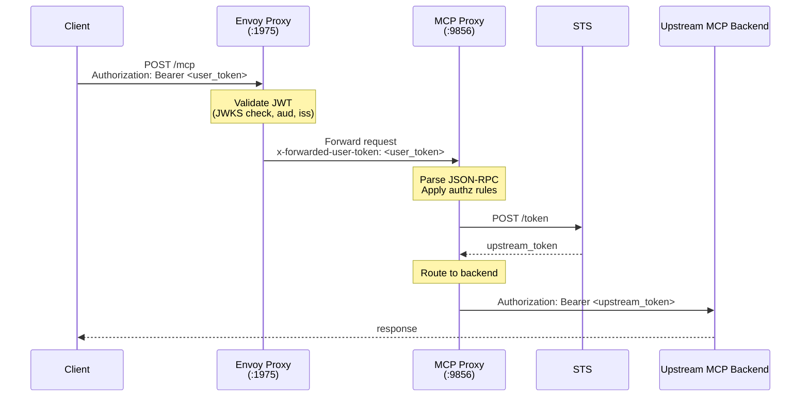

# OAuth 2.0 Token Exchange as Upstream Auth for MCP Backends

## Table of Contents

1. [Background and Motivation](#background-and-motivation)
2. [Current State of MCP Upstream Auth](#current-state-of-mcp-upstream-auth)
3. [Goals and Non-Goals](#goals-and-non-goals)
4. [RFC-8693 - OAuth 2.0 Token Exchange Overview](#rfc-8693---oauth-20-token-exchange-overview)
5. [API Proposal](#api-proposal)
   - 5.1 [New Type: `MCPBackendTokenExchange`](#new-type-mcpbackendtokenexchange)
   - 5.2 [Updated `MCPBackendSecurityPolicy`](#updated-mcpbackendsecuritypolicy)
   - 5.3 [Full Configuration Example](#full-configuration-example)
6. [Security Considerations](#security-considerations)
   - 6.1 [Token Validation Before Exchange](#token-validation-before-exchange)
   - 6.2 [Audience (`aud`) Claim Recommended Configuration](#audience-aud-claim-recommended-configuration)
   - 6.3 [Issuers - Trust Anchors and Verification](#issuers---trust-anchors-and-verification)
   - 6.4 [Subjects - Identity Propagation and Preservation](#subjects---identity-propagation-and-preservation)
   - 6.5 [Delegation vs. Impersonation - Choosing the Right Semantics](#delegation-vs-impersonation---choosing-the-right-semantics)
   - 6.6 [Scope Narrowing and the Principle of Least Privilege](#scope-narrowing-and-the-principle-of-least-privilege)
   - 6.7 [Client Authentication at the STS](#client-authentication-at-the-sts)
   - 6.8 [The `act` Claim and Delegation Chain Integrity](#the-act-claim-and-delegation-chain-integrity)
   - 6.9 [Token Caching and Replay Prevention](#token-caching-and-replay-prevention)
   - 6.10 [TLS Enforcement](#tls-enforcement)
7. [Implementation Details](#implementation-details)
   - 7.1 [RFC-8693 Token exchange Implementation](#rfc-8693-token-exchange-implementation)
   - 7.2 [Caching Strategy](#caching-strategy)
   - 7.3 [Error Handling and Failure Modes](#error-handling-and-failure-modes)

## Background and Motivation

Envoy AI Gateway functions as an MCP aggregating proxy, fronting multiple upstream MCP backends and presenting them as a single unified endpoint to clients. Today, clients authenticate to the gateway using OAuth 2.0 / JWT tokens or API keys. However, when the gateway needs to authenticate to the upstream MCP backends, it only supports static API key injection - a static credential stored in a Kubernetes Secret or provided inline.

This static API key model has several limitations in modern enterprise and multi-tenant deployments:

1. **No identity propagation.** The upstream MCP backend receives a generic service API key. It has no way to know _which end user_ originated the request, making per-user auditing, per-user rate limiting, and per-user authorization impossible at the backend.
2. **Shared credential blast radius.** A single leaked API key compromises all users' access to that backend. There is no per-user token isolation.
3. **No context-aware authorization.** The backend cannot enforce fine-grained authorization based on who the user is, what scopes they have, or what they are trying to do - the gateway is opaque.
4. **Rotation challenges.** Static API keys must be manually rotated; there is no standard automated lifecycle tied to user session tokens.
5. **No federation support.** Enterprises with strict identity federation requirements cannot propagate their IdP's user tokens to backend services without a token translation layer.

[OAuth 2.0 Token Exchange (RFC-8693)](https://datatracker.ietf.org/doc/html/rfc8693) directly addresses these limitations: it allows the gateway to act as an OAuth client and exchange the validated incoming user token for a new token that is valid for the specific upstream MCP backend. The resulting upstream token:

- Carries the user's identity (via `sub` claim)
- Is scoped to the specific backend (via `aud` claim)
- Can carry reduced/narrowed permissions (via `scope`)
- Records the delegation chain (via `act` claim)
- Has a short lifetime tied to the session

## Current State of MCP Upstream Auth

The current `MCPBackendSecurityPolicy` type supports a single upstream auth method:

```go
// MCPBackendSecurityPolicy defines the security policy for an MCP backend.
// Only API key authentication is currently supported.
type MCPBackendSecurityPolicy struct {
	APIKey *MCPBackendAPIKey `json:"apiKey,omitempty"`
}

type MCPBackendAPIKey struct {
	SecretRef  *gwapiv1.SecretObjectReference `json:"secretRef,omitempty"`
	Inline     *string                        `json:"inline,omitempty"`
	Header     *string                        `json:"header,omitempty"`
	QueryParam *string                        `json:"queryParam,omitempty"`
}
```

This is configured per backend ref in an `MCPRoute`:

```yaml
spec:
  backendRefs:
    - name: github-mcp
      kind: Backend
      securityPolicy:
        apiKey:
          secretRef:
            name: github-access-token # Injected as: Authorization: Bearer <key>
```

The credential is entirely static and carries no user identity. This proposal adds `tokenExchange` as a new alternative to `apiKey` within `MCPBackendSecurityPolicy`.

## Goals and Non-Goals

### Goals

- Define a new `tokenExchange` upstream auth option for MCP backends within `MCPBackendSecurityPolicy`
- Support [RFC-8693 (Token Exchange)](https://datatracker.ietf.org/doc/html/rfc8693) as the protocol for obtaining upstream tokens
- Preserve user identity across the gateway-to-backend boundary
- Support both delegation and impersonation semantics
- Support audience, scope, and issuer configuration to enable correct security posture
- Support static gateway client credentials for authenticating the gateway itself to the STS
- Support token caching to avoid per-request STS calls
- Be consistent with the existing MCP API design patterns in AIGW

### Non-Goals

- This proposal does **not** change how clients authenticate _to_ the gateway (that remains handled by `MCPRouteSecurityPolicy`)
- This proposal does **not** implement a full STS within AIGW itself - it delegates token issuance to an external OAuth 2.0 Authorization Server
- This proposal does **not** address non-MCP backends (e.g., LLM backends use `BackendSecurityPolicy`; a separate extension could adapt this pattern there)
- Rich Authorization Requests (RFC 9396) are **not** in scope for this proposal and may be addressed in a future iteration
- Refresh token management is explicitly out of scope for the initial proposal (see [Caveats](#9-caveats-and-tradeoffs))

## RFC-8693 - OAuth 2.0 Token Exchange Overview

RFC-8693 defines a new OAuth 2.0 grant type (`urn:ietf:params:oauth:grant-type:token-exchange`) that enables a client (here, the gateway) to submit an existing token to a Security Token Service (STS) and receive a new token in exchange. The exchange request carries:

| Parameter              | Role                                                               |
| ---------------------- | ------------------------------------------------------------------ |
| `grant_type`           | Always `urn:ietf:params:oauth:grant-type:token-exchange`           |
| `subject_token`        | The incoming user token from the client request                    |
| `subject_token_type`   | The type of the subject token (e.g., access token, JWT)            |
| `actor_token`          | Optional: a token representing the gateway itself (for delegation) |
| `actor_token_type`     | Required if `actor_token` is present                               |
| `audience`             | The logical name of the target MCP backend                         |
| `resource`             | The URI of the target MCP backend                                  |
| `scope`                | The desired scopes for the issued token (typically a subset)       |
| `requested_token_type` | The desired type of the issued token                               |

The RFC distinguishes two key semantics:

- **Delegation:** The gateway acts _on behalf of_ the user. The issued token contains both the original user as `sub` and the gateway as `act.sub`. Downstream can see both identities.
- **Impersonation:** The gateway acts _as_ the user. The issued token's `sub` is the user. The gateway is invisible. This is appropriate when the backend should see the user as a first-class principal with no knowledge of the gateway.

## API Proposal

### New Type: `MCPBackendTokenExchange`

```go
// MCPBackendTokenExchange configures OAuth 2.0 Token Exchange (RFC-8693) as the
// upstream authentication method for an MCP backend. The gateway exchanges the
// incoming user token for a new token valid for the specific MCP backend by
// calling an external Security Token Service (STS).
//
// +kubebuilder:validation:XValidation:rule="has(self.stsEndpoint)",message="stsEndpoint is required"
type MCPBackendTokenExchange struct {
	// STSEndpoint is the URL of the OAuth 2.0 token endpoint of the Security Token
	// Service (STS) that will perform the token exchange. Must be an HTTPS URL.
	//
	// +kubebuilder:validation:Required
	// +kubebuilder:validation:Format=uri
	STSEndpoint string `json:"stsEndpoint"`

	// SubjectTokenType is the token type URI for the subject_token parameter as defined in RFC-8693 §3.
	// Defaults to "urn:ietf:params:oauth:token-type:access_token".
	//
	// +kubebuilder:default="urn:ietf:params:oauth:token-type:access_token"
	// +optional
	SubjectTokenType *string `json:"subjectTokenType,omitempty"`

	// Audience specifies the intended audience for the issued upstream token.
	// This is used as the "audience" parameter in the token exchange request (RFC-8693 §2.1)
	// and will appear as the "aud" claim in the issued JWT.
	//
	// +optional
	Audience *string `json:"audience,omitempty"`

	// Resource is the URI of the upstream MCP backend resource, used as the
	// "resource" parameter in the exchange request (RFC-8693 §2.1, RFC 8707).
	//
	// +optional
	// +kubebuilder:validation:Format=uri
	Resource *string `json:"resource,omitempty"`

	// Scopes lists the OAuth 2.0 scopes to request for the issued upstream token.
	// These are used as the "scope" parameter in the exchange request.
	//
	// +optional
	Scopes []string `json:"scopes,omitempty"`

	// RequestedTokenType specifies the desired type of the issued token.
	// Defaults to "urn:ietf:params:oauth:token-type:access_token".
	//
	// +kubebuilder:default="urn:ietf:params:oauth:token-type:access_token"
	// +optional
	RequestedTokenType *string `json:"requestedTokenType,omitempty"`

	// ActorToken configures the credential that identifies the gateway itself to the STS.
	// This is used as the "actor_token" parameter in the exchange. The actor token represents
	// the gateway's identity and is used by the STS to establish a delegation chain in the issued token.
	//
	// +optional
	ActorToken *MCPBackendTokenExchangeActorToken `json:"actorToken,omitempty"`

	// ClientAuth configures how the gateway authenticates itself as an OAuth client to the STS
	// token endpoint. This is separate from the actor token and applies to the client_id/client_secret
	// used in the token exchange HTTP request itself.
	//
	// If not set, the STS request is made without client authentication (unauthenticated client).
	// This is NOT RECOMMENDED for production.
	//
	// +optional
	ClientAuth *MCPTokenExchangeClientAuth `json:"clientAuth,omitempty"`

	// Cache configures token caching behavior to avoid performing a token exchange on every request.
	// Caching is keyed on (subject_token, audience, scope).
	//
	// NOTE: Token caching is not yet implemented. This field is reserved for future use.
	//
	// +optional
	Cache *MCPTokenExchangeCacheConfig `json:"cache,omitempty"`
}

// MCPBackendTokenExchangeActorToken configures the credential used as the actor_token in the token
// exchange request, representing the gateway's identity.
//
// Exactly one of SecretRef or ClientAssertionJWT must be set.
//
// +kubebuilder:validation:XValidation:rule="(has(self.secretRef) && !has(self.clientAssertionJWT)) || (!has(self.secretRef) && has(self.clientAssertionJWT))",message="exactly one of secretRef or clientAssertionJWT must be set"
type MCPBackendTokenExchangeActorToken struct {
	// SecretRef references a Kubernetes Secret containing the actor token.
	// The Secret must have a key "token" containing the actor token value.
	//
	// +optional
	SecretRef *gwapiv1.SecretObjectReference `json:"secretRef,omitempty"`

	// ClientAssertionJWT configures the gateway to generate a signed JWT as the actor token
	// using a private key. This is the RECOMMENDED approach as it avoids long-lived static
	// tokens and enables key rotation.
	//
	// NOTE: JWT actor token generation is not yet implemented. This field is reserved for future use.
	//
	// +optional
	ClientAssertionJWT *MCPTokenExchangeJWTActorConfig `json:"clientAssertionJWT,omitempty"`
}

// MCPTokenExchangeJWTActorConfig configures JWT generation for the actor token.
//
// NOTE: This configuration is defined for future use. JWT actor token generation is not yet implemented.
type MCPTokenExchangeJWTActorConfig struct {
	// Issuer is the "iss" claim value in the generated JWT.
	// Typically the gateway's client ID or identifier at the STS.
	//
	// +kubebuilder:validation:Required
	Issuer string `json:"issuer"`

	// Subject is the "sub" claim value in the generated JWT.
	// Typically the gateway's service account identifier.
	//
	// +kubebuilder:validation:Required
	Subject string `json:"subject"`

	// PrivateKeyRef references a Kubernetes Secret containing the private key used to sign the JWT.
	// The secret must have a key "privateKey" containing a PEM-encoded RSA or EC private key.
	//
	// +kubebuilder:validation:Required
	PrivateKeyRef gwapiv1.SecretObjectReference `json:"privateKeyRef"`

	// SigningAlgorithm specifies the JWT signing algorithm.
	//
	// +kubebuilder:default="RS256"
	// +kubebuilder:validation:Enum=RS256;RS384;RS512;ES256;ES384;ES512;PS256;PS384;PS512;HS256;HS384;HS512
	// +optional
	SigningAlgorithm *string `json:"signingAlgorithm,omitempty"`

	// Lifetime is the TTL of the generated JWT in seconds. Defaults to 300 (5 minutes).
	//
	// +kubebuilder:default=300
	// +optional
	Lifetime *int32 `json:"lifetime,omitempty"`
}

// MCPTokenExchangeClientAuth configures client authentication at the STS token endpoint.
// This is how the gateway authenticates itself as an OAuth 2.0 client (client_id + credential).
//
// +kubebuilder:validation:XValidation:rule="has(self.clientID)",message="clientID is required"
// +kubebuilder:validation:XValidation:rule="has(self.clientSecretRef)",message="clientSecretRef is required"
type MCPTokenExchangeClientAuth struct {
	// ClientID is the OAuth 2.0 client identifier for the gateway at the STS.
	//
	// +kubebuilder:validation:Required
	ClientID string `json:"clientID"`

	// ClientSecretRef references a Kubernetes Secret containing the client secret.
	// The Secret must have a key "clientSecret".
	//
	// +kubebuilder:validation:Required
	ClientSecretRef gwapiv1.SecretObjectReference `json:"clientSecretRef"`
}

// MCPTokenExchangeCacheConfig configures token caching for exchanged tokens.
//
// NOTE: Token caching is not yet implemented. This field is reserved for future use.
type MCPTokenExchangeCacheConfig struct {
	// TTL is the maximum time to cache an exchanged token.
	//
	// +kubebuilder:validation:Required
	TTL gwapiv1.Duration `json:"ttl"`
}
```

### Updated `MCPBackendSecurityPolicy`

```go
// MCPBackendSecurityPolicy defines the security policy for authenticating the gateway to an upstream MCP backend.
// Exactly one of APIKey or TokenExchange must be set.
//
// +kubebuilder:validation:XValidation:rule="!(has(self.apiKey) && has(self.tokenExchange))",message="only one of apiKey or tokenExchange can be set"
type MCPBackendSecurityPolicy struct {
	// APIKey is a mechanism to access a backend. The API key will be injected into the request headers.
	// +optional
	APIKey *MCPBackendAPIKey `json:"apiKey,omitempty"`

	// TokenExchange configures OAuth 2.0 Token Exchange (RFC-8693) as the upstream auth method.
	// The gateway exchanges the incoming user token for a new token valid for this specific backend
	// by calling an external Security Token Service (STS).
	//
	// +optional
	TokenExchange *MCPBackendTokenExchange `json:"tokenExchange,omitempty"`
}
```

### Full Configuration Example

The following example shows a complete `MCPRoute` with token exchange configured for an upstream MCP backend (e.g., a GitHub Copilot MCP server) with delegation semantics:

```yaml
apiVersion: aigateway.envoyproxy.io/v1alpha1
kind: MCPRoute
metadata:
  name: enterprise-mcp-route
  namespace: default
spec:
  parentRefs:
    - name: envoy-ai-gateway
  path: "/mcp"

  # Client-facing auth: clients must present a valid JWT from the enterprise IdP
  securityPolicy:
    oauth:
      issuer: "https://idp.enterprise.com"
      audiences: ["https://aigw.enterprise.com/mcp"]
      jwks:
        remoteJWKS:
          uri: "https://idp.enterprise.com/.well-known/jwks.json"
    authorization:
      defaultAction: Deny
      rules:
        - source:
            jwt:
              scopes: ["mcp:access"]
          target:
            tools:
              names: ["*"]
          action: Allow

  backendRefs:
    - name: github-copilot-mcp
      kind: Backend
      group: gateway.envoyproxy.io
      port: 443
      path: "/mcp"

      securityPolicy:
        tokenExchange:
          stsEndpoint: "https://sts.enterprise.com/oauth/token"
          # Type for the incoming subject token
          subjectTokenType: "urn:ietf:params:oauth:token-type:access_token"
          # Request a standard access token
          requestedTokenType: "urn:ietf:params:oauth:token-type:access_token"
          # The upstream backend's audience identifier
          # This becomes the "aud" claim in the issued token
          audience: "https://api.githubcopilot.com"
          resource: "https://api.githubcopilot.com/mcp"
          # Request only the scopes the backend actually needs
          # (narrower than the incoming user token's scopes)
          scopes:
            - "copilot:mcp:read"
            - "copilot:mcp:tools"
          # The gateway's identity token for the delegation act claim
          actorToken:
            clientAssertionJWT:
              issuer: "aigw-enterprise-gateway"
              subject: "aigw-enterprise-gateway"
              privateKeyRef:
                name: aigw-gateway-signing-key
                namespace: default
              signingAlgorithm: "RS256"
              lifetime: 300
          # Client authentication at the STS token endpoint
          clientAuth:
            clientID: "aigw-enterprise-gateway"
            clientSecretRef:
              name: aigw-sts-client-secret
              namespace: default
          # Cache exchanged tokens for up to 5 minutes
          cache:
            ttl: 300s
```

## Security Considerations

### Token Validation Before Exchange

The gateway must not exchange a token it has not itself validated. Performing a token exchange with a non-validated or expired token could allow replay attacks, token injection, or privilege escalation.

The `MCPRoute.spec.securityPolicy.oauth` section (which configures the gateway-facing JWT validation) MUST be configured when `tokenExchange` is used as upstream auth. A CRD validation rule should enforce this.

### Audience (`aud`) Claim Recommended Configuration

The `aud` claim is one of the most important security controls in JWT-based authorization. An issued token with an overly broad or absent audience can be used to authenticate to unintended services.

Two distinct audience boundaries exist in this flow:

- **Incoming Token Audience (Gateway-Facing):** The incoming user token's `aud` claim MUST match the gateway's configured `audiences` in `MCPRoute.spec.securityPolicy.oauth.audiences`. This is validated by the JWT filter before any processing and ensures the user token was issued specifically for the gateway - not for some other service - and cannot be replayed from another context.
- **Outgoing Token Audience (Backend-Facing):** The `MCPBackendTokenExchange.Audience` and `MCPBackendTokenExchange.Resource` fields specify the `audience` and `resource` parameters in the exchange request. The STS uses these to set the `aud` claim in the issued token to exactly the target backend's identifier. Example: `audience: "https://api.githubcopilot.com"`.

If neither `Audience` nor `Resource` is set in the token exchange config, the STS determines the audience itself - and different STSes have different defaults. Some may issue tokens with an overly broad audience or even no `aud` at all. An upstream MCP backend validating `aud` would either fail or (if audience validation is not enforced) accept a token that could also be valid for other services. By requiring operators to explicitly set `Audience`, we ensure each backend gets tokens with a tightly-scoped audience.

### Issuers - Trust Anchors and Verification

The system involves multiple token issuers. Incorrect issuer configuration can lead to trusting tokens from unauthorized sources. Three issuers are involved:

- **Incoming Token Issuer (the enterprise IdP):** Configured in `MCPRoute.spec.securityPolicy.oauth.issuer`. The JWT filter validates that the incoming token's `iss` claim matches this value exactly. Only tokens from the configured issuer are accepted.
- **STS Issuer (the token exchange service):** The STS that performs the exchange is identified by `stsEndpoint`. The gateway does not need to independently validate the STS's issued tokens (it trusts the STS's response over HTTPS). However, the upstream MCP backend MUST be configured to trust tokens issued by this STS (i.e., the STS's `iss` value must be in the backend's trusted issuers list).
- **Actor Token Issuer (the gateway itself):** When `actorToken.clientAssertionJWT` is used, the gateway generates JWTs with `iss` set to the configured `Issuer` value. The STS must be pre-configured to trust this issuer for actor tokens. The `Issuer` value should be a unique, unambiguous identifier for this gateway instance - not shared with any other service.

The separation of issuers at each boundary prevents cross-context token reuse. A user token issued by the enterprise IdP cannot be used as an actor token (wrong issuer). A gateway actor token cannot be presented as a user token (wrong issuer, wrong claims). This defense-in-depth approach ensures each party in the chain can only present credentials appropriate to their role.

### Subjects - Identity Propagation and Preservation

The end-to-end identity of the user must be preserved through the gateway. The upstream backend should be able to attribute operations to specific users for auditing, rate limiting, and authorization purposes.

In **Delegation mode** (when the `actorToken` information is configured), the issued upstream token's `sub` claim is the original user's identifier (copied from the incoming token's `sub`). The `act` claim identifies the gateway. The upstream backend can see:

```json
{
  "sub": "user@enterprise.com",
  "act": { "sub": "aigw-enterprise-gateway" },
  "aud": "https://api.githubcopilot.com"
}
```

In **Impersonation mode**, only the `sub` is carried forward; the gateway is invisible.

Without `sub` preservation, all requests to the upstream backend appear to come from the same service account (the gateway), making per-user auditing, billing, and policy enforcement impossible at the backend. With `sub` preserved, the backend can implement per-user rate limiting, per-user data isolation, and produce user-attributed audit logs - all without the gateway needing to implement these itself.

### Delegation vs. Impersonation - Choosing the Right Semantics

Choosing between delegation and impersonation has significant security and operational implications.

|                             | Delegation                        | Impersonation                                   |
| --------------------------- | --------------------------------- | ----------------------------------------------- |
| Gateway visible to backend? | **Yes** (in `act` claim)          | **No**                                          |
| User identity preserved     | **Yes** (in `sub`)                | **Yes** (in `sub`)                              |
| Auditability                | Full chain visible                | Only user visible                               |
| `actor_token` required      | **Yes**                           | No                                              |
| Confused deputy risk        | Lower (gateway must authenticate) | Higher (anyone with user token can impersonate) |
| Recommended for             | Most enterprise deployments       | When backend must see user as direct caller     |

Delegation is strongly recommended for most use cases. Impersonation should only be used when the upstream MCP backend is designed to receive direct user tokens and does not support delegation semantics - for example, a legacy service that only validates `sub` and would be confused by the `act` claim.

### Scope Narrowing and the Principle of Least Privilege

Tokens with broad scopes can be used for more than intended. The gateway should not issue upstream tokens with more permissions than the operation requires. The `Scopes` field in `MCPBackendTokenExchange` explicitly narrows the scopes requested in the exchange. The gateway should configure backend-specific minimal scopes:

When `scopes` is set in the exchange request, the STS validates that the requested scopes are a subset of the subject token's granted scopes. The STS MUST reject the exchange with `invalid_request` if any requested scope exceeds what the subject token has. The gateway cannot use this mechanism to _escalate_ privileges - it can only narrow them.

Each `MCPRouteBackendRef` has its own `securityPolicy.tokenExchange` with its own `scopes`. This allows different backends in the same `MCPRoute` to receive tokens with different minimal scope sets, even when the incoming user token has broad access.

### Client Authentication at the STS

Without client authentication, any party that obtains a user's access token can exchange it for tokens scoped to any backend. This is a significant token amplification attack vector.

**RFC-8693 §5 states:** _"Note that omitting client authentication allows for a compromised token to be leveraged via an STS into other tokens by anyone possessing the compromised token. Thus, client authentication allows for additional authorization checks by the STS as to which entities are permitted to impersonate or receive delegations from other entities."_

### The `act` Claim and Delegation Chain Integrity

Multi-hop delegation chains (gateway A → gateway B → MCP backend) can obscure the original delegation path, leading to authorization decisions based on incomplete information.

The `act` claim nesting defined in RFC-8693 §4.1 naturally supports multi-hop chains:

```json
{
  "sub": "user@enterprise.com",
  "act": {
    "sub": "aigw-enterprise-gateway",
    "act": {
      "sub": "upstream-intermediary"
    }
  }
}
```

### Token Caching and Replay Prevention

Performing a full STS round-trip for every MCP request introduces significant latency and load on the STS. Caching is necessary but introduces risks.

Exchanged tokens are cached with a composite key:

```
cache_key = hash(subject_token + audience + sorted(scopes))
```

Including `subject_token` in the cache key ensures:

- Tokens for different users are never shared
- After a user's session expires (and they re-authenticate with a new token), the cached upstream token is not reused
- A compromised token (revoked by the user or AS) will cease to produce cache hits once the subject token changes

**Revocation gap:** If the subject token is revoked by the user or AS _after_ an exchange has already been cached, the cached upstream token remains valid until expiry. This is an inherent limitation of bearer token caching. Operators can mitigate this by:

1. Setting short `ttlSeconds` values (at the cost of more STS calls)
2. Using STS implementations that support token revocation propagation
3. Setting short `exp` values in exchange responses at the STS level

**Replay prevention:** The cached token should never be reused if the incoming `subject_token` has changed (different user, re-authenticated user, etc.), ensured by the subject_token inclusion in the cache key.

### TLS Enforcement

Token exchange transmits sensitive credentials over the network. The `stsEndpoint` field is recommended to have an `https://` URL prefix. All communication with the STS is over TLS. Non-TLS STS endpoints are rejected at the API level.
This implements RFC-8693 §5's requirement: _"Tokens employed in the context of the functionality described herein... MUST only be transmitted over encrypted channels, such as Transport Layer Security (TLS)."_

The upstream MCP backend communication is separately secured by the existing Envoy TLS configuration (via `BackendTLSPolicy`), which is unaffected by this proposal.

## Implementation Details

The following diagram illustrates the end-to-end flow when token exchange is configured for an MCP backend:



1. Client sends a request to AIGW with a user JWT in the `Authorization: Bearer` header.
2. Envoy's `MCPRouteSecurityPolicy` validates the JWT (signature, expiry, issuer, audience against the gateway's configured JWKS).
3. The validated token (or a header carrying it) is forwarded to the MCP Proxy.
4. The MCP Proxy parses the JSON-RPC request, applies tool-level authorization rules, and selects the target backend.
5. **Token Exchange** is performed: the MCP Proxy (acting as OAuth client) calls the STS token endpoint with the user token as `subject_token`, the backend identifier as `audience`/`resource`, and the desired `scope`.
6. The STS validates the user token, checks policy, and issues a new upstream token scoped to the backend.
7. The upstream token is cached (keyed by user token + backend + scope) and set on the outgoing request.
8. The backend listener injects the upstream token as `Authorization: Bearer <upstream_token>` before forwarding to the upstream MCP backend.

### RFC-8693 Token Exchange Implementation

Token exchange can be implemented:

- By Envoy AI Gateway at the MCP Proxy.
- Using the Built On Envoy [Token Exchange Dynamic Module](https://builtonenvoy.io/extensions/token-exchange/).
- Implementing Token Exchange in the [Envoy Credential Injector filter](https://www.envoyproxy.io/docs/envoy/latest/configuration/http/http_filters/credential_injector_filter).

The proposed initial implementation is to use the existing Built On Envoy Dynamic Module, as the needed functionality is already implemented.
Adding support for Token Exchange in Envoy upstream is a nice future addition, but ideally we should not block this feature in Envoy AI Gateway
on that being available.

### Caching Strategy

The cache is an in-memory LRU cache within the MCP Proxy process, keyed by the hash described the previous sections. The cache is per-process (not distributed), which is acceptable because:

- Each AIGW replica independently validates incoming tokens and can independently exchange them
- The slight STS overhead on horizontal scaling (multiple replicas each caching independently) is acceptable
- A distributed cache would add operational complexity without significantly changing the security posture

### Error Handling and Failure Modes

| Failure                        | Behavior                                             | Rationale                                     |
| ------------------------------ | ---------------------------------------------------- | --------------------------------------------- |
| STS endpoint unreachable       | Return 503 to client                                 | Cannot proceed without a valid upstream token |
| STS returns `invalid_request`  | Return 403 to client with logged error               | Configuration error; retrying won't help      |
| STS returns `invalid_target`   | Return 403 to client                                 | Audience/resource not supported by STS        |
| STS returns 5xx                | Retry with backoff, then 503                         | Transient STS failure                         |
| Subject token validation fails | Return 401 (handled upstream by JWT filter)          | Never reaches exchange stage                  |
| Cached token nearing expiry    | Proactive background refresh (optional, future work) | Prevent expiry during active sessions         |
