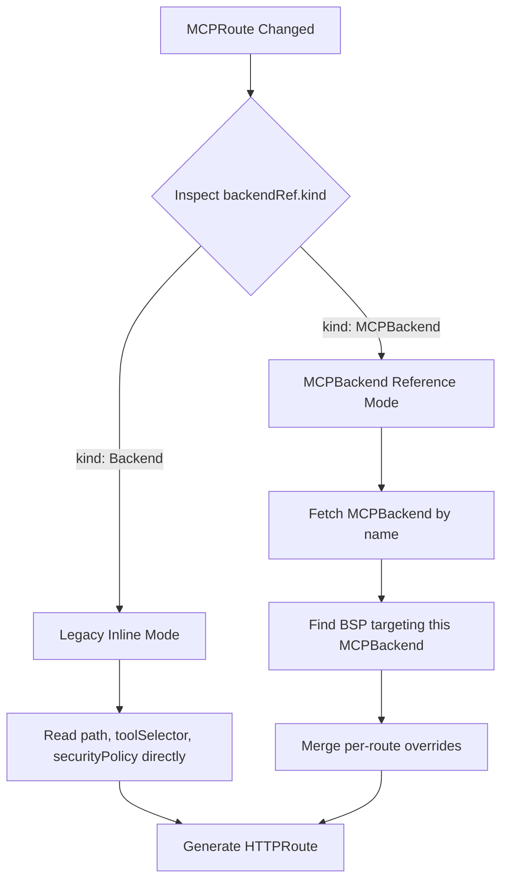
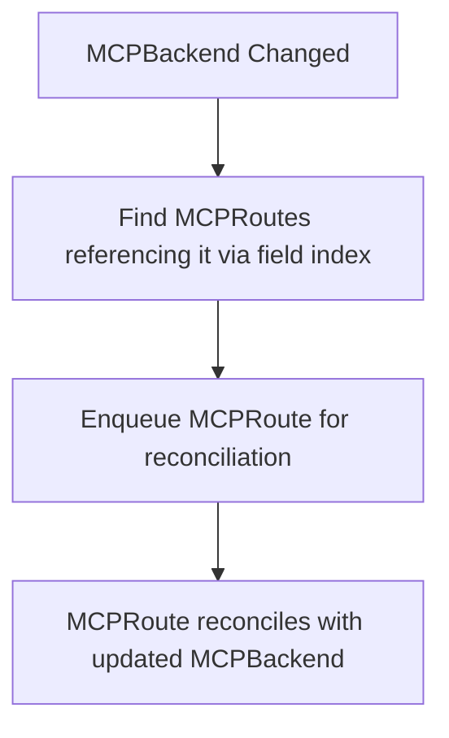
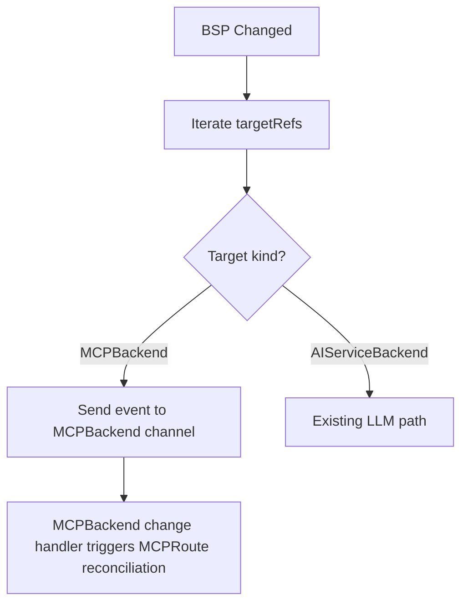

# Standalone MCPBackend CRD: Replacing Inline BackendRef in MCPRoute

## Table of Contents

1. [Background and Motivation](#background-and-motivation)
2. [Current State](#current-state)
   - 2.1 [MCPRoute Inline Backend Configuration](#mcproute-inline-backend-configuration)
   - 2.2 [LLM-Side Pattern: AIServiceBackend + BackendSecurityPolicy](#llm-side-pattern-aiservicebackend--backendsecuritypolicy)
   - 2.3 [Historical Context: How AIServiceBackend Evolved](#historical-context-how-aiservicebackend-evolved)
3. [Goals and Non-Goals](#goals-and-non-goals)
4. [Design Approaches](#design-approaches)
   - 4.1 [Approach 1: MCPBackend CRD with Inline Security Policy](#approach-1-mcpbackend-crd-with-inline-security-policy)
   - 4.2 [Approach 2: MCPBackend CRD + Separate Security Policy CRD](#approach-2-mcpbackend-crd--separate-security-policy-crd)
     - 4.2a [Option A: SecurityPolicy has targetRefs for MCPBackends (Policy Attachment)](#option-a-securitypolicy-has-targetrefs-for-mcpbackends-policy-attachment)
     - 4.2b [Option B: MCPBackend has a ref field for SecurityPolicy](#option-b-mcpbackend-has-a-ref-field-for-securitypolicy)
     - 4.2c [Option C: MCPRoute has a ref field for SecurityPolicy](#option-c-mcproute-has-a-ref-field-for-securitypolicy)
   - 4.3 [Approach 3: Use Envoy Gateway's SecurityPolicy CRD](#approach-3-use-envoy-gateways-securitypolicy-crd)
5. [New CRD vs. Extending Existing BackendSecurityPolicy](#new-crd-vs-extending-existing-backendsecuritypolicy)
6. [MCPRouteBackendRef Backward Compatibility](#mcproutebackendref-backward-compatibility)
   - 6.1 [Option 1: Keep Inline BackendObjectReference Embedding](#option-1-keep-inline-backendobjectreference-embedding)
   - 6.2 [Option 2: Explicit Name/Group/Kind Fields (AIGatewayRouteRuleBackendRef Pattern)](#option-2-explicit-namegroupkind-fields-aigatewayroterulebackendref-pattern)
7. [Conclusion](#conclusion)
8. [API Proposal](#api-proposal)
   - 8.1 [New Type: MCPBackend](#new-type-mcpbackend)
   - 8.2 [Updated MCPRouteBackendRef](#updated-mcproutebackendref)
   - 8.3 [Updated BackendSecurityPolicy](#updated-backendsecuritypolicy)
   - 8.4 [Full Configuration Example](#full-configuration-example)
9. [Implementation Details](#implementation-details)

## Background and Motivation

MCP backend configuration in Envoy AI Gateway is entirely inlined within the `MCPRoute` resource. Each backend's MCP-specific concerns — endpoint path, tool selectors, security policy (API key injection), and header forwarding — are embedded directly in `MCPRoute.spec.backendRefs[]`:

```go
// MCPRouteBackendRef wraps a EG's BackendObjectReference to reference an MCP server.
// TODO: move to a standalone MCPBackend CRD to avoid k8s object size limit.
type MCPRouteBackendRef struct {
	gwapiv1.BackendObjectReference `json:",inline"`
	Path                           *string                   `json:"path,omitempty"`
	ToolSelector                   *MCPToolFilter            `json:"toolSelector,omitempty"`
	SecurityPolicy                 *MCPBackendSecurityPolicy `json:"securityPolicy,omitempty"`
	ForwardHeaders                 []MCPHeaderForward        `json:"forwardHeaders,omitempty"`
}
```

This design has three escalating problems:

### 1. Kubernetes Object Size Limit

A single Kubernetes object is limited to ~1.5 MB (etcd value size). `MCPRoute` allows up to 256 backends (`MaxItems=256`), each carrying a `ToolSelector` with 4 lists of up to 32 strings, a security policy, and up to 32 forward headers. The codebase already acknowledges this with a TODO on `MCPRouteBackendRef`.

### 2. Token Exchange Makes Inline Security Policy Untenable

The [Token Exchange proposal (010)](../010-mcp-token-exchange/proposal.md) adds substantial configuration to `MCPBackendSecurityPolicy`: STS endpoint, audience, resource, scopes, actor token (with JWT signing config), client authentication credentials, and caching. This ~25 lines of deeply nested config per backend is qualitatively different from the ~3 lines of API key config that the inline model was designed for.

Token exchange fields — `stsEndpoint`, `audience`, `clientAuth` — are properties of the backend's trust relationship with the STS, not of the routing relationship between an MCPRoute and a backend. Embedding them in the route conflates independent lifecycle concerns: routing topology (which changes when you add/remove routes) and backend identity/auth (which changes when you rotate credentials or migrate STS).

### 3. No Reuse Across Routes

The same backend with the same security policy must be fully duplicated across every MCPRoute that references it. Changes to a backend's path, tool selectors, or credentials must be applied to every MCPRoute containing that backend.

## Current State

### MCPRoute Inline Backend Configuration

```
MCPRoute
├── spec.parentRefs[]           → Gateway attachment
├── spec.path                   → Serving endpoint
├── spec.securityPolicy         → Client-facing auth (OAuth, APIKey, ExtAuth)
└── spec.backendRefs[]          → Inline backend definitions
    ├── BackendObjectReference  → EG Backend (host, port, TLS)
    ├── path                    → MCP endpoint path on the backend
    ├── toolSelector            → Tool include/exclude filters
    ├── securityPolicy          → Upstream auth (API key only, token exchange forthcoming)
    └── forwardHeaders[]        → Header passthrough config
```

The controller (`MCPRouteController`) iterates over `backendRefs[]`, reads inline API keys from Secrets, and generates per-backend `HTTPRouteRule`s with header-based credential injection and URL rewriting.

### LLM-Side Pattern: AIServiceBackend + BackendSecurityPolicy

The LLM (inference) side separates these concerns:

```
AIGatewayRoute
└── spec.rules[].backendRefs[]
    └── name: my-openai-backend       → references AIServiceBackend by name
        modelNameOverride: ...        → per-route override
        headerMutation: ...           → per-route override

AIServiceBackend (standalone CRD)
├── spec.schema                       → API schema (OpenAI, AWSBedrock, etc.)
├── spec.backendRef                   → references EG Backend
├── spec.headerMutation               → backend-level defaults
└── spec.bodyMutation                 → backend-level defaults

BackendSecurityPolicy (standalone CRD, Policy Attachment)
├── spec.targetRefs[]                 → targets AIServiceBackend or InferencePool
├── spec.type                         → APIKey | AWSCredentials | AzureCredentials | ...
└── spec.<credentials>                → provider-specific credential config
```

Key design properties:

- `AIGatewayRouteRuleBackendRef` carries per-route overrides (`headerMutation`, `bodyMutation`, `modelNameOverride`, `weight`) on top of `AIServiceBackend`-level defaults.
- One `BackendSecurityPolicy` can target multiple `AIServiceBackend`s that share credentials (e.g., two AWS Bedrock model backends using the same IAM role).
- Credential rotation is a `BackendSecurityPolicy` edit; backend config is an `AIServiceBackend` edit.

### Historical Context: How AIServiceBackend Evolved

The current design was not the first iteration. The referenced commit [7318be65](https://github.com/envoyproxy/ai-gateway/commit/7318be65301e4b702606629029c41bb63559e756) reveals that `AIServiceBackend` originally had a `backendSecurityPolicyRef` field — the backend referenced the security policy. This was later migrated to `BackendSecurityPolicy.spec.targetRefs[]` — the policy targets the backend — to match the Gateway API Policy Attachment pattern. The old field was deprecated in v0.3.

This history is directly relevant: the LLM side already tried the "backend refs the policy" approach and abandoned it in favor of "policy targets the backend." The rationale was alignment with Gateway API conventions and better support for one policy covering multiple backends.

## Goals and Non-Goals

### Goals

- Replace inline `MCPRouteBackendRef` with a standalone `MCPBackend` CRD.
- Address the Kubernetes object size limit risk.
- Decouple security policy lifecycle from routing topology.
- Determine the best relationship model between MCPBackend and its security policy.
- Determine whether to extend the existing `BackendSecurityPolicy` CRD or create a new one.
- Maintain consistency with the LLM-side API patterns where appropriate.
- Support both existing API key auth and the forthcoming token exchange auth.
- Ensure backward compatibility with existing MCPRoute YAML.

### Non-Goals

- This proposal does **not** change client-facing authentication (`MCPRouteSecurityPolicy`).
- This proposal does **not** change how the MCP proxy internally routes requests.
- This proposal does **not** introduce new auth mechanisms — it only moves where they are configured.
- This proposal does **not** address Envoy Gateway's `SecurityPolicy` CRD for MCP backends (evaluated and rejected below).

## Design Approaches

### Approach 1: MCPBackend CRD with Inline Security Policy

All MCP backend configuration, including security policy, lives in one `MCPBackend` CRD.

```
MCPRoute
└── spec.backendRefs[]
    └── name: github-copilot-mcp      → references MCPBackend

MCPBackend (new CRD)
├── spec.backendRef                    → EG Backend (host, port, TLS)
├── spec.path                          → MCP endpoint path
├── spec.toolSelector                  → tool include/exclude filters
├── spec.forwardHeaders[]              → header passthrough config
└── spec.securityPolicy                → upstream auth (API key OR token exchange)
    ├── apiKey                         → MCPBackendAPIKey
    └── tokenExchange                  → MCPBackendTokenExchange
```

**Example YAML:**

```yaml
apiVersion: aigateway.envoyproxy.io/v1beta1
kind: MCPBackend
metadata:
  name: github-copilot-mcp
spec:
  backendRef:
    name: github-copilot
    kind: Backend
    group: gateway.envoyproxy.io
  path: "/mcp"
  toolSelector:
    includeRegex:
      - ".*pull_requests?.*"
      - ".*issues?.*"
  securityPolicy:
    tokenExchange:
      stsEndpoint: "https://sts.enterprise.com/oauth/token"
      audience: "https://api.githubcopilot.com"
      scopes: ["copilot:mcp:read", "copilot:mcp:tools"]
      clientAuth:
        clientID: "aigw-enterprise-gateway"
        clientSecretRef:
          name: aigw-sts-client-secret
---
apiVersion: aigateway.envoyproxy.io/v1beta1
kind: MCPRoute
metadata:
  name: enterprise-mcp-route
spec:
  parentRefs:
    - name: aigw-run
      kind: Gateway
  backendRefs:
    - name: github-copilot-mcp
      kind: MCPBackend
      group: aigateway.envoyproxy.io
```

**Reconciliation:**

1. `MCPRouteController` watches `MCPRoute` and `MCPBackend`.
2. On MCPRoute change → fetches referenced MCPBackends → generates HTTPRoutes.
3. On MCPBackend change → triggers reconciliation of all MCPRoutes that reference it (via field index).
4. Security policy is read directly from `MCPBackend.spec.securityPolicy` — single hop.

**Limitations:**

- **Security policy lifecycle coupled to backend.** Rotating credentials requires editing the MCPBackend, which triggers reconciliation of tool selectors, routes and path — even though those didn't change.
- **Inconsistent with LLM side.** `AIServiceBackend` does not carry security policy; `BackendSecurityPolicy` is separate. This diverges from the established pattern.
- **Token exchange config bloats MCPBackend.** The ~25 lines of token exchange config (STS credentials, actor tokens, caching) expands what should be a backend descriptor into a security configuration document.

---

### Approach 2: MCPBackend CRD + Separate Security Policy CRD

MCP backend configuration lives in `MCPBackend`; security policy lives in a separate CRD. The question is: how is the security policy associated with the backend?

#### Option A: SecurityPolicy has targetRefs for MCPBackends (Policy Attachment)

The security policy points to the backends it covers, using the Gateway API Policy Attachment pattern.

```
MCPBackend (new CRD)
├── spec.backendRef, path, toolSelector, forwardHeaders

SecurityPolicy (new or extended CRD)
├── spec.targetRefs[]                  → points to MCPBackend(s)
├── spec.type
└── spec.<credentials>
```

**Example YAML:**

```yaml
apiVersion: aigateway.envoyproxy.io/v1beta1
kind: MCPBackend
metadata:
  name: github-copilot-mcp
spec:
  backendRef:
    name: github-copilot
    kind: Backend
    group: gateway.envoyproxy.io
  path: "/mcp"
  toolSelector:
    includeRegex: [".*pull_requests?.*", ".*issues?.*"]
---
apiVersion: aigateway.envoyproxy.io/v1beta1
kind: BackendSecurityPolicy
metadata:
  name: github-sts-policy
spec:
  targetRefs:
    - group: aigateway.envoyproxy.io
      kind: MCPBackend
      name: github-copilot-mcp
  type: TokenExchange
  tokenExchange:
    stsEndpoint: "https://sts.enterprise.com/oauth/token"
    audience: "https://api.githubcopilot.com"
    scopes: ["copilot:mcp:read"]
    clientAuth:
      clientID: "aigw-enterprise-gateway"
      clientSecretRef:
        name: aigw-sts-client-secret
```

**Reconciliation:**

1. `MCPRouteController` watches MCPRoute, MCPBackend, and BackendSecurityPolicy.
2. On MCPRoute change → fetches MCPBackends → fetches BSPs targeting each MCPBackend → generates HTTPRoutes.
3. On MCPBackend change → triggers reconciliation of referencing MCPRoutes.
4. On BSP change → `BackendSecurityPolicyController.syncBackendSecurityPolicy` iterates targetRefs, sends events to `MCPBackend` event channel → triggers reconciliation of referencing MCPRoutes.
5. Field indexes: `MCPRoute → MCPBackend names`, `BSP → targeted MCPBackend names`.

**Limitations:**

- **Two-hop resolution.** Controller must resolve MCPRoute → MCPBackend → BSP. Adds watch complexity and reconciliation ordering.
- **Discovery problem.** Given an MCPBackend, finding its BSP requires a reverse lookup ("which BSPs target this MCPBackend?"). This requires an index.

---

#### Option B: MCPBackend has a ref field for SecurityPolicy

The backend points to its security policy.

```
MCPBackend (new CRD)
├── spec.backendRef, path, toolSelector, forwardHeaders
└── spec.securityPolicyRef             → points to a SecurityPolicy

SecurityPolicy (new or extended CRD)
├── spec.<credentials>                 → no targetRefs needed
```

**Example YAML:**

```yaml
apiVersion: aigateway.envoyproxy.io/v1beta1
kind: MCPBackend
metadata:
  name: github-copilot-mcp
spec:
  backendRef:
    name: github-copilot
    kind: Backend
    group: gateway.envoyproxy.io
  path: "/mcp"
  securityPolicyRef:
    name: enterprise-sts-policy
---
apiVersion: aigateway.envoyproxy.io/v1beta1
kind: MCPBackendSecurityPolicy
metadata:
  name: enterprise-sts-policy
spec:
  tokenExchange:
    stsEndpoint: "https://sts.enterprise.com/oauth/token"
    audience: "https://api.githubcopilot.com"
    clientAuth:
      clientID: "aigw-enterprise-gateway"
      clientSecretRef:
        name: aigw-sts-client-secret
```

**Reconciliation:**

1. `MCPRouteController` watches MCPRoute and MCPBackend.
2. On MCPRoute change → fetches MCPBackends → follows `securityPolicyRef` to fetch policy → generates HTTPRoutes.
3. On MCPBackend change → triggers reconciliation of referencing MCPRoutes.
4. On SecurityPolicy change → must find all MCPBackends that reference it (reverse index) → trigger their MCPRoutes.

**Limitations:**

- **Already tried and abandoned on the LLM side.** `AIServiceBackend` originally had `backendSecurityPolicyRef` (commit [7318be65](https://github.com/envoyproxy/ai-gateway/commit/7318be65301e4b702606629029c41bb63559e756)). It was deprecated in favor of `BackendSecurityPolicy.spec.targetRefs` to match Gateway API conventions. Adopting this pattern for MCP would repeat a known migration.
- **Reverse lookup for reconciliation.** When a SecurityPolicy changes, finding affected MCPBackends requires a reverse index on `securityPolicyRef`. This is the same problem that motivated the move to targetRefs on the LLM side.
- **Does not follow Gateway API Policy Attachment.** Gateway API recommends policies target the resources they apply to, not the other way around. This enables standard tooling and conventions.

---

#### Option C: MCPRoute has a ref field for SecurityPolicy

The route specifies which security policy to use per backend.

```
MCPRoute
└── spec.backendRefs[]
    ├── name: github-copilot-mcp       → references MCPBackend
    └── securityPolicyRef              → references a SecurityPolicy

MCPBackend (new CRD)
├── spec.backendRef, path, toolSelector, forwardHeaders

SecurityPolicy (new or extended CRD)
├── spec.<credentials>
```

**Example YAML:**

```yaml
apiVersion: aigateway.envoyproxy.io/v1beta1
kind: MCPRoute
metadata:
  name: enterprise-mcp-route
spec:
  backendRefs:
    - name: github-copilot-mcp
      kind: MCPBackend
      group: aigateway.envoyproxy.io
      securityPolicyRef:
        name: enterprise-sts-policy
```

**Reconciliation:**

1. `MCPRouteController` watches MCPRoute, MCPBackend, and SecurityPolicy.
2. On MCPRoute change → fetches MCPBackends + referenced SecurityPolicies → generates HTTPRoutes.
3. On SecurityPolicy change → must find all MCPRoutes that reference it → trigger reconciliation.

**Limitations:**

- **Security policy is not a route concern.** Backend credentials (STS endpoint, audience, client credentials) are properties of the backend's trust relationship with the STS, not of the routing topology. Placing the policy reference on the route conflates these concerns — the same problem the current inline design has, just with an indirection layer.
- **Route becomes a coupling point.** Adding a new MCPRoute to an existing backend requires knowing which SecurityPolicy to reference. The route author must understand the backend's authentication requirements.
- **No established precedent.** Neither the LLM side (`AIGatewayRoute` doesn't reference `BackendSecurityPolicy`) nor Gateway API uses this pattern.

---

### Approach 3: Use Envoy Gateway's SecurityPolicy CRD

Envoy Gateway's `SecurityPolicy` CRD targets HTTPRoute, Gateway, etc. The idea: attach it to the per-backend HTTPRoute that the MCPRoute controller generates.

```
MCPRoute controller generates → per-backend HTTPRoute
SecurityPolicy (Envoy Gateway)
├── spec.targetRef → per-backend HTTPRoute
└── spec.extAuth / spec.jwt
```

**Evaluation:**

- **SecurityPolicy is for client-facing auth.** Per Envoy Gateway docs: "SecurityPolicy allows you to define authentication and authorization requirements for traffic entering your gateway." It is designed for ingress auth, not upstream auth.
- **Wrong direction.** SecurityPolicy authenticates clients TO the gateway; we need to authenticate the gateway TO the backend. These are fundamentally different trust boundaries.
- **Inconsistent with LLM side.** The LLM side uses `BackendSecurityPolicy` for upstream auth, not EG's `SecurityPolicy`. Using `SecurityPolicy` for MCP upstream auth would be a unique snowflake pattern.

**Conclusion:** This approach is fundamentally misaligned with the purpose of Envoy Gateway's SecurityPolicy and is **rejected**.

## New CRD vs. Extending Existing BackendSecurityPolicy

### Option: Extend Existing BackendSecurityPolicy

Add `MCPAPIKey` and `TokenExchange` types to `BackendSecurityPolicySpec`, and allow `targetRefs` to accept `MCPBackend`.

**Pros:**

- **One policy CRD for all backends.** Users learn one model. Platform teams manage one resource type.
- **Existing controller infrastructure.** `BackendSecurityPolicyController` already handles watch/reconciliation for `targetRefs`. Adding `MCPBackend` as a target kind extends the existing code path.

**Cons:**

- **Growing discriminated union.** Adding 2 types to the existing 6 creates 8 types with N² CEL validation rules. Each new type must assert all other type-specific fields are absent.
- **Type-to-target coupling.** `MCPBackendAPIKey` supports `inline`, `header`, and `queryParam` — fields that the LLM-side `BackendSecurityPolicyAPIKey` (which only has `secretRef`) does not. These are fundamentally different API key models.`MCPAPIKey` and `TokenExchange` should only target `MCPBackend`. LLM types should not target `MCPBackend`. This requires additional CEL rules to enforce.

### Option: New MCPBackendSecurityPolicy CRD

Create a separate `MCPBackendSecurityPolicy` CRD specifically for MCP upstream auth.

**Pros:**

- **Clean separation.** MCP auth types don't bloat the LLM-side CRD. No N² validation explosion.
- **MCP-specific fields are natural.** `inline`, `header`, `queryParam`, `tokenExchange` all fit without being shoehorned into a CRD designed for cloud provider credentials.

**Cons:**

- **CRD proliferation.** A third policy CRD (alongside `BackendSecurityPolicy` and `MCPRouteSecurityPolicy`).
- **Token exchange cannot be shared.** If LLM backends later need token exchange, it either duplicates into `BackendSecurityPolicy` or requires yet another refactoring.
- **Operational overhead.** Platform teams manage more resource types.

### Assessment

Extending the existing `BackendSecurityPolicy` is preferred because:

1. The CEL validation complexity is real but manageable — the pattern already exists for 6 types.
2. The existing controller infrastructure (`BackendSecurityPolicyController`) reduces implementation effort.

## MCPRouteBackendRef Backward Compatibility

The existing `MCPRouteBackendRef` inlines `gwapiv1.BackendObjectReference` (providing `name`, `kind`, `group`, `port`, `namespace`) along with `path`, `toolSelector`, `securityPolicy`, and `forwardHeaders`. The new struct must support both legacy inline EG Backend references and new MCPBackend references without breaking existing YAML.

Both options below use `kind`/`group` values to distinguish legacy inline backends from MCPBackend references. The controller dispatches based on:

- `kind: Backend`, `group: gateway.envoyproxy.io` → legacy inline mode (existing behavior).
- `kind: MCPBackend`, `group: aigateway.envoyproxy.io` → MCPBackend reference mode.

In both options, existing YAML continues to work unchanged:

```yaml
# LEGACY FORMAT — kind: Backend (works unchanged in both options)
backendRefs:
  - name: github
    kind: Backend
    group: gateway.envoyproxy.io
    path: "/mcp/readonly"
    toolSelector:
      includeRegex: [".*pull_requests?.*"]
    securityPolicy:
      apiKey:
        secretRef:
          name: github-access-token

# NEW FORMAT — kind: MCPBackend (works in both options)
backendRefs:
  - name: github-copilot-mcp
    kind: MCPBackend
    group: aigateway.envoyproxy.io
    toolSelector:                          # per-route override
      includeRegex: [".*list.*", ".*get.*"]
    securityPolicy:                        # per-route override (only override-able fields)
      tokenExchange:
        scopes: ["copilot:mcp:read"]
```

### Option 1: Keep Inline BackendObjectReference Embedding

Retain the existing inline `gwapiv1.BackendObjectReference`. All its fields (`name`, `kind`, `group`, `port`, `namespace`) remain at the top level. CEL validation constrains which fields are valid for each mode.

```go
type MCPRouteBackendRef struct {
	gwapiv1.BackendObjectReference `json:",inline"`

	// Legacy inline fields
	Path *string `json:"path,omitempty"`

	// Fields valid in both modes (primary definition in legacy, override in MCPBackend mode)
	ToolSelector   *MCPToolFilter            `json:"toolSelector,omitempty"`
	ForwardHeaders []MCPHeaderForward        `json:"forwardHeaders,omitempty"`
	SecurityPolicy *MCPBackendSecurityPolicy `json:"securityPolicy,omitempty"`
}
```

In legacy mode (`kind: Backend`), `securityPolicy` is the full definition (API key or token exchange config). In MCPBackend mode (`kind: MCPBackend`), `securityPolicy` acts as a per-route override — only override-able fields are permitted (e.g., `tokenExchange.scopes` to narrow scopes for this route). CEL validation enforces that non-override fields (`tokenExchange.stsEndpoint`, `tokenExchange.clientAuth`, `apiKey`) are not set in MCPBackend mode.

**Pros:**

- Minimal Go source change — the inline embedding stays, only CEL rules are added.
- DeepCopy and existing controller references to `ref.BackendObjectReference` continue to compile unchanged.
- No new fields needed — reuses existing `securityPolicy` struct with mode-dependent semantics.

**Cons:**

- `port` and `namespace` fields from `BackendObjectReference` are present but meaningless for MCPBackend references. CEL can reject `port`, but `namespace` has no sensible enforcement.
- Same field has different semantics per mode (full definition vs. override). Documentation and CEL must make this clear.

### Option 2: Explicit Name/Group/Kind Fields (AIGatewayRouteRuleBackendRef Pattern)

Replace the inline `BackendObjectReference` with explicit `Name`, `Group`, `Kind` fields. `Port` and `Namespace` become explicit legacy-only fields. This follows the pattern established by `AIGatewayRouteRuleBackendRef`:

```go
// from api/v1beta1/ai_gateway_route.go
type AIGatewayRouteRuleBackendRef struct {
	Name      string             `json:"name"`
	Namespace *gwapiv1.Namespace `json:"namespace,omitempty"`
	Group     *string            `json:"group,omitempty"`
	Kind      *string            `json:"kind,omitempty"`
	// ... per-route fields
}
```

```go
type MCPRouteBackendRef struct {
	Name  string `json:"name"`
	Group string `json:"group"`
	Kind  string `json:"kind"`

	// Legacy inline fields (kind: Backend only)
	Port      *gwapiv1.PortNumber `json:"port,omitempty"`
	Namespace *gwapiv1.Namespace  `json:"namespace,omitempty"`
	Path      *string             `json:"path,omitempty"`

	// Fields valid in both modes (primary definition in legacy, override in MCPBackend mode)
	ToolSelector   *MCPToolFilter            `json:"toolSelector,omitempty"`
	ForwardHeaders []MCPHeaderForward        `json:"forwardHeaders,omitempty"`
	SecurityPolicy *MCPBackendSecurityPolicy `json:"securityPolicy,omitempty"`
}
```

In legacy mode (`kind: Backend`), `securityPolicy` is the full definition. In MCPBackend mode (`kind: MCPBackend`), it acts as a per-route override — only override-able fields are permitted (e.g., `tokenExchange.scopes`). CEL validation enforces that in MCPBackend mode, only `securityPolicy.tokenExchange.scopes` may be set; fields like `stsEndpoint`, `clientAuth`, `actorToken`, and `apiKey` are rejected.

**Pros:**

- Clean field grouping — legacy-only fields structurally separated from shared fields.
- No dangling artifacts for `port`, `namespace`, `path`. CEL rules enforce these cannot be set for MCPBackend references.
- No new fields needed — `securityPolicy` serves double duty with mode-dependent semantics.
- Follows established precedent from `AIGatewayRouteRuleBackendRef`.

**Cons:**

- Go source breaking change — existing controller code accessing `ref.BackendObjectReference` or `ref.BackendObjectReference.Name` must be updated (compile-time, not runtime).
- DeepCopy regeneration required.
- Same `securityPolicy` field has different semantics per mode — requires clear documentation.

### Backward Compatibility Comparison

| Criterion                          | Option 1 (Inline Embedding)                    | Option 2 (Explicit Fields)                           |
| ---------------------------------- | ---------------------------------------------- | ---------------------------------------------------- |
| **Wire format change**             | None                                           | None (same JSON field names)                         |
| **Existing YAML breaks?**          | No                                             | No                                                   |
| **Go source change**               | Minimal (add CEL rules)                        | Moderate (replace embedding, update controller refs) |
| **New fields needed**              | None (reuses securityPolicy)                   | None (reuses securityPolicy)                         |
| **Dangling fields for MCPBackend** | `port`, `namespace` present but meaningless    | Every field explicitly scoped                        |
| **kubectl explain clarity**        | `port`/`namespace` shown for MCPBackend        | Clean separation                                     |
| **Precedent in codebase**          | Current `MCPRouteBackendRef`                   | `AIGatewayRouteRuleBackendRef`                       |
| **CEL enforcement**                | Can reject `port`; `namespace` hard to enforce | All legacy fields cleanly gated                      |
| **securityPolicy reuse**           | Yes (override semantics in MCPBackend mode)    | Yes (override semantics in MCPBackend mode)          |

**Recommendation:** Option 2 (Explicit Fields). It aligns with `AIGatewayRouteRuleBackendRef`, eliminates dangling fields, and the Go source change is caught at compile time.

## Conclusion

**Approach 2A (MCPBackend CRD + Extend Existing BackendSecurityPolicy with Policy Attachment)** is recommended, combined with **Option 2 (Explicit Name/Group/Kind fields)** for backward compatibility.

### Why Approach 2A?

1. **Proven pattern.** The LLM side already uses `BackendSecurityPolicy.targetRefs[]` → `AIServiceBackend`. The controller infrastructure (`syncBackendSecurityPolicy`, event channels, field indexes) already exists and needs only to be extended for `MCPBackend` kind.
2. **Historical validation.** The LLM side tried "backend refs the policy" (Approach 2B) and abandoned it in commit [7318be65](https://github.com/envoyproxy/ai-gateway/commit/7318be65301e4b702606629029c41bb63559e756) in favor of Policy Attachment. Choosing 2B for MCP would repeat a known mistake.
3. **Security lifecycle decoupled.** Credential rotation edits `BackendSecurityPolicy`, not `MCPBackend`. Different teams can own different resources with appropriate RBAC.
4. **Per-route overrides follow established pattern.** `MCPRouteBackendRef` carries `securityPolicy` (with override semantics for token exchange scopes), `toolSelector`, and `forwardHeaders` overrides — the same "backend owns defaults, route owns overrides" model as `AIGatewayRouteRuleBackendRef.headerMutation`.
5. **Gateway API alignment.** Policy Attachment is the canonical Gateway API pattern for associating policies with resources.

### Why extend existing BackendSecurityPolicy rather than creating a new CRD?

- **One policy CRD for all backends** reduces cognitive load.
- **Token exchange may be needed for LLM backends** in the future. Having it in `BackendSecurityPolicy` from the start avoids a future migration.
- The **CEL validation complexity** is real but manageable — the pattern already exists for 6 types.
- **Type-to-target validation** prevents misuse: a CEL rule enforces that `MCPAPIKey` and `TokenExchange` types can only target `MCPBackend` resources.

## API Proposal

### New Type: MCPBackend

```go
// MCPBackend is a resource that represents a single upstream MCP server.
// It wraps an Envoy Gateway Backend with MCP-specific configuration including
// the server endpoint path, tool selectors, and header forwarding rules.
//
// An MCPBackend is referenced by MCPRoute.spec.backendRefs[] and can be targeted
// by a BackendSecurityPolicy for upstream authentication configuration.
//
// +genclient
// +k8s:deepcopy-gen:interfaces=k8s.io/apimachinery/pkg/runtime.Object
// +kubebuilder:object:root=true
// +kubebuilder:subresource:status
// +kubebuilder:printcolumn:name="Status",type=string,JSONPath=`.status.conditions[-1:].type`
// +kubebuilder:storageversion
type MCPBackend struct {
	metav1.TypeMeta   `json:",inline"`
	metav1.ObjectMeta `json:"metadata,omitempty"`
	Spec              MCPBackendSpec   `json:"spec,omitempty"`
	Status            MCPBackendStatus `json:"status,omitempty"`
}

type MCPBackendSpec struct {
	// BackendRef references the Envoy Gateway Backend (network-level: hostname, port, TLS).
	//
	// +kubebuilder:validation:Required
	// +kubebuilder:validation:XValidation:rule="has(self.kind) && self.kind == 'Backend' && has(self.group) && self.group == 'gateway.envoyproxy.io'",message="must reference an Envoy Gateway Backend"
	BackendRef gwapiv1.BackendObjectReference `json:"backendRef"`

	// Path is the HTTP endpoint path of the backend MCP server. Defaults to "/mcp".
	// +kubebuilder:default:=/mcp
	// +optional
	Path *string `json:"path,omitempty"`

	// ToolSelector filters the tools exposed by this MCP server.
	// +optional
	ToolSelector *MCPToolFilter `json:"toolSelector,omitempty"`

	// ForwardHeaders specifies headers to extract from client requests and forward to this backend.
	// +kubebuilder:validation:MaxItems=32
	// +optional
	ForwardHeaders []MCPHeaderForward `json:"forwardHeaders,omitempty"`
}
```

### Updated MCPRouteBackendRef

```go
// MCPRouteBackendRef references either an inline EG Backend (legacy) or an MCPBackend resource.
// Format detection via kind/group:
//   - kind: Backend + group: gateway.envoyproxy.io → legacy inline mode.
//   - kind: MCPBackend + group: aigateway.envoyproxy.io → MCPBackend reference mode.
//
// +kubebuilder:validation:XValidation:rule="has(self.group) && has(self.kind)",message="group and kind must be specified"
// +kubebuilder:validation:XValidation:rule="(self.group == 'gateway.envoyproxy.io' && self.kind == 'Backend') || (self.group == 'aigateway.envoyproxy.io' && self.kind == 'MCPBackend')",message="must be Backend (gateway.envoyproxy.io) or MCPBackend (aigateway.envoyproxy.io)"
// +kubebuilder:validation:XValidation:rule="!(self.kind == 'MCPBackend') || (!has(self.path) && !has(self.port) && !has(self.namespace))",message="path, port, and namespace are not valid for MCPBackend references"
// +kubebuilder:validation:XValidation:rule="!(self.kind == 'MCPBackend' && has(self.securityPolicy)) || (has(self.securityPolicy.tokenExchange) && !has(self.securityPolicy.apiKey))",message="in MCPBackend mode, securityPolicy may only contain tokenExchange overrides"
// +kubebuilder:validation:XValidation:rule="!(self.kind == 'MCPBackend' && has(self.securityPolicy) && has(self.securityPolicy.tokenExchange)) || (!has(self.securityPolicy.tokenExchange.stsEndpoint) && !has(self.securityPolicy.tokenExchange.clientAuth) && !has(self.securityPolicy.tokenExchange.actorToken))",message="in MCPBackend mode, only tokenExchange.scopes is allowed as override"
type MCPRouteBackendRef struct {
	// Name of the backend resource.
	// For kind: Backend → name of the EG Backend.
	// For kind: MCPBackend → name of the MCPBackend in the same namespace.
	//
	// +kubebuilder:validation:Required
	// +kubebuilder:validation:MinLength=1
	Name string `json:"name"`

	// Group of the backend resource.
	// "gateway.envoyproxy.io" for EG Backend (legacy), "aigateway.envoyproxy.io" for MCPBackend.
	//
	// +kubebuilder:validation:Required
	Group string `json:"group"`

	// Kind of the backend resource.
	// "Backend" for EG Backend (legacy), "MCPBackend" for MCPBackend.
	//
	// +kubebuilder:validation:Required
	Kind string `json:"kind"`

	// --- Legacy inline fields (kind: Backend only) ---

	// Port is the port number of the backend. Only valid for kind: Backend.
	// +optional
	Port *gwapiv1.PortNumber `json:"port,omitempty"`

	// Namespace of the backend resource. Only valid for kind: Backend.
	// +optional
	Namespace *gwapiv1.Namespace `json:"namespace,omitempty"`

	// Path is the HTTP endpoint path of the backend MCP server.
	// Only valid for kind: Backend. Use MCPBackend.spec.path instead.
	// +kubebuilder:default:=/mcp
	// +optional
	Path *string `json:"path,omitempty"`

	// --- Fields valid in both modes ---

	// ToolSelector filters the tools exposed by this MCP server.
	// Legacy mode: primary definition. MCPBackend mode: per-route override (narrows MCPBackend.spec.toolSelector).
	// +optional
	ToolSelector *MCPToolFilter `json:"toolSelector,omitempty"`

	// ForwardHeaders specifies headers to forward to this backend.
	// Legacy mode: primary definition. MCPBackend mode: per-route override (extends MCPBackend.spec.forwardHeaders).
	// +kubebuilder:validation:MaxItems=32
	// +optional
	ForwardHeaders []MCPHeaderForward `json:"forwardHeaders,omitempty"`

	// SecurityPolicy defines security configuration for this backend reference.
	// Legacy mode (kind: Backend): full security policy definition (API key or token exchange).
	// MCPBackend mode (kind: MCPBackend): per-route override. Only override-able fields are
	// allowed — specifically tokenExchange.scopes to narrow scopes for this route.
	// The scopes must be a subset of those configured in the BackendSecurityPolicy's
	// tokenExchange.scopes targeting this MCPBackend.
	// +optional
	SecurityPolicy *MCPBackendSecurityPolicy `json:"securityPolicy,omitempty"`
}
```

### Updated BackendSecurityPolicy

```go
const (
	// Existing types...
	BackendSecurityPolicyTypeAPIKey           BackendSecurityPolicyType = "APIKey"
	BackendSecurityPolicyTypeAWSCredentials   BackendSecurityPolicyType = "AWSCredentials"
	BackendSecurityPolicyTypeAzureAPIKey      BackendSecurityPolicyType = "AzureAPIKey"
	BackendSecurityPolicyTypeAnthropicAPIKey  BackendSecurityPolicyType = "AnthropicAPIKey"
	BackendSecurityPolicyTypeAzureCredentials BackendSecurityPolicyType = "AzureCredentials"
	BackendSecurityPolicyTypeGCPCredentials   BackendSecurityPolicyType = "GCPCredentials"
	// New types for MCP backends.
	BackendSecurityPolicyTypeMCPAPIKey     BackendSecurityPolicyType = "MCPAPIKey"
	BackendSecurityPolicyTypeTokenExchange BackendSecurityPolicyType = "TokenExchange"
)

type BackendSecurityPolicySpec struct {
	// TargetRefs — extended to also accept MCPBackend.
	// +kubebuilder:validation:XValidation:rule="self.all(ref,
	//   (ref.group == 'aigateway.envoyproxy.io' && ref.kind == 'AIServiceBackend') ||
	//   (ref.group == 'inference.networking.k8s.io' && ref.kind == 'InferencePool') ||
	//   (ref.group == 'aigateway.envoyproxy.io' && ref.kind == 'MCPBackend')
	// )", message="targetRefs must reference AIServiceBackend, InferencePool, or MCPBackend"
	TargetRefs []gwapiv1a2.LocalPolicyTargetReference `json:"targetRefs,omitempty"`

	Type BackendSecurityPolicyType `json:"type"`

	// ... existing fields unchanged ...

	// MCPAPIKey configures MCP-specific API key injection (header, queryParam, inline).
	// +optional
	MCPAPIKey *MCPBackendAPIKey `json:"mcpAPIKey,omitempty"`

	// TokenExchange configures OAuth 2.0 Token Exchange (RFC-8693).
	// +optional
	TokenExchange *MCPBackendTokenExchange `json:"tokenExchange,omitempty"`
}
```

**Type-to-target CEL validation:**

```
// MCP types can only target MCPBackend
self.type in ['MCPAPIKey', 'TokenExchange'] ?
  self.targetRefs.all(ref, ref.group == 'aigateway.envoyproxy.io' && ref.kind == 'MCPBackend') : true

// LLM types cannot target MCPBackend
self.type in ['APIKey', 'AWSCredentials', 'AzureAPIKey', 'AzureCredentials', 'GCPCredentials', 'AnthropicAPIKey'] ?
  self.targetRefs.all(ref, ref.kind != 'MCPBackend') : true
```

### Full Configuration Example

```yaml
# ─── EG Backends (networking) ────────────────────────────────────
apiVersion: gateway.envoyproxy.io/v1alpha1
kind: Backend
metadata:
  name: github-copilot
spec:
  endpoints:
    - fqdn:
        hostname: api.githubcopilot.com
        port: 443
---
apiVersion: gateway.envoyproxy.io/v1alpha1
kind: Backend
metadata:
  name: kiwi
spec:
  endpoints:
    - fqdn:
        hostname: mcp.kiwi.com
        port: 443
---
# ─── MCPBackends (MCP-specific config) ──────────────────────────
apiVersion: aigateway.envoyproxy.io/v1beta1
kind: MCPBackend
metadata:
  name: github-copilot-mcp
spec:
  backendRef:
    name: github-copilot
    kind: Backend
    group: gateway.envoyproxy.io
  path: "/mcp"
  toolSelector:
    includeRegex:
      - ".*pull_requests?.*"
      - ".*issues?.*"
---
apiVersion: aigateway.envoyproxy.io/v1beta1
kind: MCPBackend
metadata:
  name: kiwi-mcp
spec:
  backendRef:
    name: kiwi
    kind: Backend
    group: gateway.envoyproxy.io
  path: "/"
---
# ─── BackendSecurityPolicies (upstream auth) ─────────────────────
apiVersion: aigateway.envoyproxy.io/v1beta1
kind: BackendSecurityPolicy
metadata:
  name: github-token-exchange
spec:
  targetRefs:
    - group: aigateway.envoyproxy.io
      kind: MCPBackend
      name: github-copilot-mcp
  type: TokenExchange
  tokenExchange:
    stsEndpoint: "https://sts.enterprise.com/oauth/token"
    subjectTokenType: "urn:ietf:params:oauth:token-type:access_token"
    requestedTokenType: "urn:ietf:params:oauth:token-type:access_token"
    audience: "https://api.githubcopilot.com"
    resource: "https://api.githubcopilot.com/mcp"
    scopes:
      - "copilot:mcp:read"
      - "copilot:mcp:tools"
    actorToken:
      clientAssertionJWT:
        issuer: "aigw-enterprise-gateway"
        subject: "aigw-enterprise-gateway"
        privateKeyRef:
          name: aigw-gateway-signing-key
        signingAlgorithm: "RS256"
        lifetime: 300
    clientAuth:
      clientID: "aigw-enterprise-gateway"
      clientSecretRef:
        name: aigw-sts-client-secret
    cache:
      ttl: 300s
---
apiVersion: aigateway.envoyproxy.io/v1beta1
kind: BackendSecurityPolicy
metadata:
  name: kiwi-apikey
spec:
  targetRefs:
    - group: aigateway.envoyproxy.io
      kind: MCPBackend
      name: kiwi-mcp
  type: MCPAPIKey
  mcpAPIKey:
    secretRef:
      name: kiwi-access-token
---
# ─── MCPRoute (routing — full access) ───────────────────────────
apiVersion: aigateway.envoyproxy.io/v1beta1
kind: MCPRoute
metadata:
  name: enterprise-mcp-route
spec:
  parentRefs:
    - name: aigw-run
      kind: Gateway
      group: gateway.networking.k8s.io
  path: "/mcp"
  securityPolicy:
    oauth:
      issuer: "https://idp.enterprise.com"
      audiences: ["https://aigw.enterprise.com/mcp"]
      protectedResourceMetadata:
        resource: "https://aigw.enterprise.com/mcp"
  backendRefs:
    - name: github-copilot-mcp
      kind: MCPBackend
      group: aigateway.envoyproxy.io
    - name: kiwi-mcp
      kind: MCPBackend
      group: aigateway.envoyproxy.io
---
# ─── MCPRoute (routing — read-only with per-route overrides) ─────
apiVersion: aigateway.envoyproxy.io/v1beta1
kind: MCPRoute
metadata:
  name: readonly-mcp-route
spec:
  parentRefs:
    - name: aigw-run
      kind: Gateway
      group: gateway.networking.k8s.io
  path: "/mcp-readonly"
  securityPolicy:
    oauth:
      issuer: "https://idp.enterprise.com"
      audiences: ["https://aigw.enterprise.com/mcp"]
      protectedResourceMetadata:
        resource: "https://aigw.enterprise.com/mcp-readonly"
  backendRefs:
    - name: github-copilot-mcp
      kind: MCPBackend
      group: aigateway.envoyproxy.io
      toolSelector:
        includeRegex: [".*list.*", ".*get.*"]
      securityPolicy:
        tokenExchange:
          scopes: ["copilot:mcp:read"]
    - name: kiwi-mcp
      kind: MCPBackend
      group: aigateway.envoyproxy.io
```

## Implementation Details

### Controller Changes

1. **New `MCPBackendController`**: watches `MCPBackend` resources. On changes, triggers reconciliation of referencing MCPRoutes via field index.

2. **`BackendSecurityPolicyController` extension**: `syncBackendSecurityPolicy` already iterates `targetRefs` and dispatches events by kind. Adding an `MCPBackend` case follows the existing `AIServiceBackend`/`InferencePool` pattern:

```go
case targetRef.Group == mcpBackendGroup && targetRef.Kind == mcpBackendKind:
    var mcpBackend aigv1b1.MCPBackend
    if err := c.client.Get(ctx, client.ObjectKey{
        Name: string(targetRef.Name), Namespace: bsp.Namespace,
    }, &mcpBackend); err != nil {
        // handle error
    }
    c.mcpBackendEventChan <- event.GenericEvent{Object: &mcpBackend}
```

3. **`MCPRouteController` dual-mode dispatch**: the reconciler inspects each `backendRef` entry's `kind`/`group` values:

```go
for _, ref := range mcpRoute.Spec.BackendRefs {
	switch {
	case ref.Kind == "Backend" && ref.Group == "gateway.envoyproxy.io":
		// Legacy inline mode — existing code path.
		rule, err = c.inlineBackendRefToHTTPRouteRule(ctx, mcpRoute, &ref)
	case ref.Kind == "MCPBackend" && ref.Group == "aigateway.envoyproxy.io":
		// MCPBackend reference mode — new code path.
		rule, err = c.mcpBackendRefToHTTPRouteRule(ctx, mcpRoute, &ref)
	}
}
```

In the new path, the controller fetches `MCPBackend` by `ref.Name` → resolves its `BackendSecurityPolicy` via a field index → merges per-route overrides (`toolSelector`, `forwardHeaders`, `securityPolicy.tokenExchange.scopes`) → generates HTTPRoutes.

4. **Field indexes**:
   - `MCPRoute → MCPBackend names` (for reverse lookup on MCPBackend change)
   - `BackendSecurityPolicy → targeted MCPBackend names` (for BSP → MCPBackend → MCPRoute chain)

### MCP Proxy Changes

The MCP proxy receives backend configuration via the internal API (ConfigMap or gRPC). The proxy does not directly interact with CRDs. Changes are transparent — the proxy receives the same resolved configuration regardless of whether it came from inline `MCPRouteBackendRef` or standalone `MCPBackend` + `BackendSecurityPolicy`.

### Reconciliation Flow Diagrams

#### MCPRoute Reconciliation (Dual-Mode Dispatch)



#### MCPBackend Change Propagation



#### BackendSecurityPolicy Change Propagation


