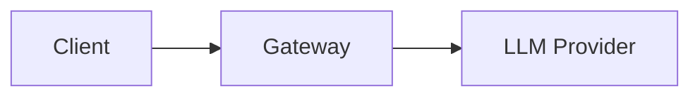

# Envoy AI Gateway Documentation Site

This file provides guidelines for AI coding assistants working on the documentation site.

## Tech Stack

- **Framework**: Docusaurus 3.9.x with TypeScript
- **UI**: React 19
- **Diagrams**: Mermaid (enabled via `@docusaurus/theme-mermaid`)
- **Node.js**: 22.0+ required
- **Package Manager**: npm 10.9.0

## Project Structure

```
site/
├── docs/                    # Current/latest documentation
├── blog/                    # Blog posts organized by year
├── src/
│   ├── components/          # Custom React components
│   ├── css/                 # Custom styles
│   ├── data/                # JSON data files (releases, adopters, talks)
│   ├── pages/               # Custom pages (homepage, release notes)
│   └── theme/               # Theme customizations
├── static/                  # Static assets (images, favicons)
├── versioned_docs/          # Snapshots of docs for previous versions
├── versioned_sidebars/      # Sidebar configs for previous versions
├── docusaurus.config.ts     # Main Docusaurus configuration
└── sidebars.ts              # Sidebar configuration (auto-generated)
```

## Documentation Conventions

### Frontmatter

All documentation files require frontmatter:

```yaml
---
id: unique-page-id
title: Page Title
sidebar_position: 1
---
```

- `id`: Unique identifier for the page (used in URLs and links)
- `title`: Display title in sidebar and page header
- `sidebar_position`: Controls ordering in the auto-generated sidebar (lower numbers appear first)

### Admonitions

Use Docusaurus admonition syntax for callouts:

```md
:::tip
Helpful tips for users
:::

:::info
Additional information
:::

:::warning
Important warnings
:::

:::danger
Critical warnings about destructive actions
:::
```

### Internal Links

Use relative paths for internal links:

```md
[Prerequisites](./prerequisites.md)
[Getting Started](/docs/getting-started)
```

### Mermaid Diagrams

Mermaid is enabled. Use fenced code blocks:

````md

````

## Documentation Verification

When generating or updating documentation, **always verify accuracy** against the source code and API specifications in the repository:

### Code Verification

- Cross-reference documented features with the actual implementation in `/internal/` and `/api/`
- Verify configuration options, field names, and default values match the Go struct definitions
- Check that documented behaviors align with the code logic

### API Spec Verification

- Ensure documented API fields match the CRD definitions in `/api/`
- Verify types, required fields, and enum values against the Go types
- Check for any newly added or deprecated fields that may need documentation updates

### Best Practices

- Read relevant source files before writing documentation about a feature
- When documenting configuration options, locate the corresponding Go structs to confirm field names and types
- If documentation conflicts with code, the code is the source of truth—update the documentation accordingly
- Run `npm run build` to catch broken links and ensure all references are valid

## Blog Post Conventions

### File Location

Place blog posts in `blog/YYYY/` with the naming format:

```
blog/YYYY/YYYY-MM-DD-slug.md
```

Example: `blog/2025/2025-10-02-mcp-implementation.md`

### Frontmatter

Blog posts require specific frontmatter:

```yaml
---
slug: short-url-slug
title: Full Blog Post Title
authors: [author-key]
tags: [news, features]
image: /img/blog/hero-image.png
description: Short description for SEO and social cards
---
```

- `slug`: URL-friendly identifier (appears in `/blog/slug`)
- `authors`: Array of author keys from `blog/authors.yml`
- `tags`: Array of tags (defined in `blog/tags.yml`)
- `image`: Hero image for social sharing (store in `static/img/blog/`)
- `description`: Used for SEO meta tags and social cards

### Authors

Authors must be defined in `blog/authors.yml` before use:

```yaml
username:
  name: Full Name
  title: Role - Organization
  url: https://github.com/username
  image_url: https://github.com/username.png
  page: true
  socials:
    github: username
    linkedin: https://linkedin.com/in/username/
```

### Images

- Store blog images in `static/img/blog/`
- Reference with absolute paths: `/img/blog/filename.png`
- Use descriptive alt text for accessibility
- Images in `static/img/blog/` are used by the homepage "Latest Blogs" component

### Truncation

Use the truncate marker to set the preview cutoff on the blog listing page:

```md
Introduction paragraph shown in the listing...

<!-- truncate -->

Full content continues here...
```

## Versioned Documentation

### Structure

- **Current docs**: `docs/` (served at `/docs/`)
- **Versioned snapshots**: `versioned_docs/version-X.Y/`
- **Version config**: Defined in `docusaurus.config.ts`

### Guidelines

- Edit `docs/` for current/latest documentation
- Avoid editing `versioned_docs/` unless backporting critical fixes
- Version snapshots are created during releases

## Custom Components

### Available MDX Components

The `ApiField` component is available in all MDX files:

```jsx
<ApiField name="fieldName" type="string" required>
  Description of the field
</ApiField>
```

### Adding New Components

1. Create component in `src/components/`
2. Register in `src/theme/MDXComponents.tsx` for global MDX availability

## Development

### Commands

```bash
npm install       # Install dependencies
npm start         # Start dev server (hot reload)
npm run build     # Production build
npm run serve     # Serve production build locally
npm run typecheck # TypeScript type checking
```

### Local Development

The dev server runs at `http://localhost:3000` with hot reload enabled.

### Building

Always run `npm run build` before committing to catch broken links and build errors. The build is configured to throw on broken links (`onBrokenLinks: 'throw'`).
