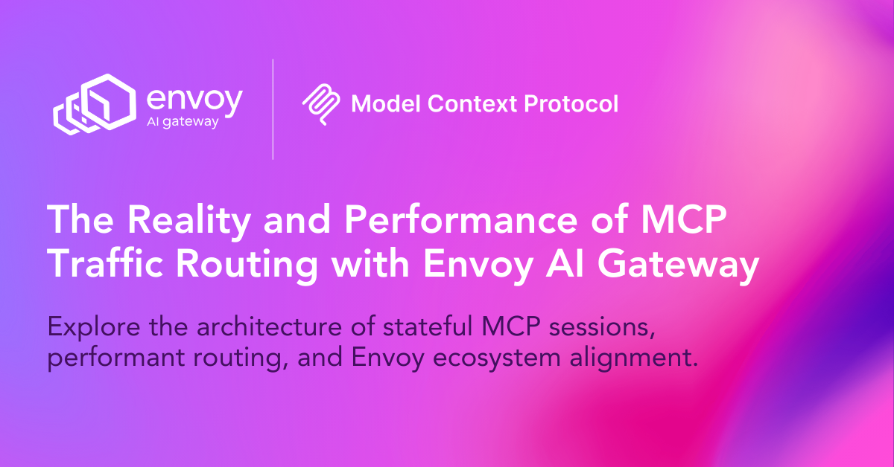
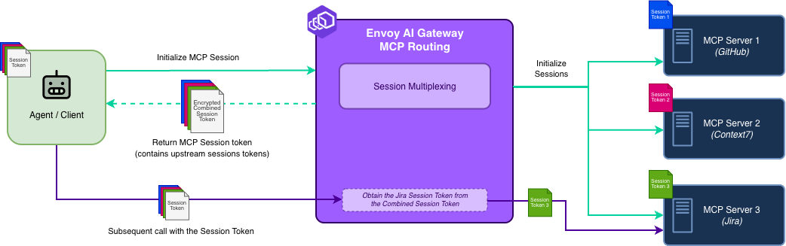
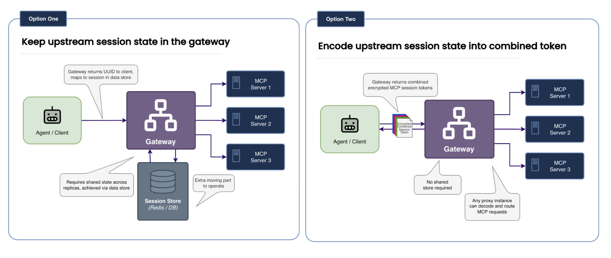

Envoy AI Gateway (AIGW) provides a production-ready bridge between AI agents and their tools by handling Model Context Protocol (MCP) traffic. As teams adopt MCP, questions about scale, performance, and architecture naturally arise.

This post addresses those questions by first clearing up common misunderstandings, then diving into the actual architecture, the design choices we made (and why), and how you can test and evaluate whether it is the right solution for your system.

**This post will give you the context you need to:**

- Evaluate MCP routing in Envoy AI Gateway with realistic expectations
- Understand the design decisions, their impact, and how they impact you
- Learn about how you can configure and tune MCP routing in Envoy AI Gateway to meet your needs

<!-- truncate -->

## **Part 1: Common Misconceptions**

Before discussing how it works, let’s address how people _think_ it works. There are a few frequent misconceptions about how Envoy AI Gateway handles MCP traffic.

### **Misconception 1:** "AI Gateway's MCP implementation is slow."

#### Reality

The AIGW MCP implementation offers performance comparable to other cloud-native solutions while providing full access to all Envoy traffic-handling features.

#### The Nuance

The default configuration settings balance performance, functionality, and security. If you want to further reduce latency based on your use case, you can easily adjust the configuration to prioritize raw speed in internal or low-latency environments.

### **Misconception 2:** "Envoy AI Gateway is a separate project that ignores core Envoy."

#### Reality

Envoy AI Gateway is deeply integrated into the Envoy Ecosystem. It extends the Envoy Gateway control plane and leverages Envoy Proxy data-plane extensions.

It is not a fork or a side project running in isolation; it is designed to feed proven implementations back into Envoy core, accelerating the adoption of emerging patterns like MCP that require faster iteration than the core release cycle typically allows.

### **Misconception 3:** “Envoy is not able to handle AI traffic.”

#### Reality

The Envoy proxy's architecture is ideally suited for managing AI traffic, including use cases like MCP. Both LLM and MCP traffic ultimately rely on HTTP. As a cloud-native, battle-tested HTTP proxy utilized at scale for over a decade, Envoy is a proven solution.

Furthermore, the [Envoy community is actively working](https://github.com/search?q=repo%3Aenvoyproxy%2Fenvoy+mcp&type=pullrequests&s=created&o=desc) toward making the core Envoy proxy fully MCP-compliant. This future compatibility means Envoy AI Gateway users will be able to leverage the standard Envoy proxy for their data plane needs.

#### The Nuance

Currently, Envoy AI Gateway leverages Envoy Proxy extensions to fill functionality gaps and enable MCP routing via Envoy Proxy. This is thanks to Envoy Proxy's extensible architecture, which allows us to rapidly respond to and handle the various challenges the new era of AI gives us.

---

## **Part 2: The Actual Architecture**

The core challenge of MCP is that it is currently a **stateful protocol**. A session ID must be reused across calls so the server can maintain context. When you place a gateway in the middle, a single client session might need to route to multiple upstream MCP servers (e.g., GitHub, Jira, local files), each maintaining its own independent session.

### The "Stateless" MCP Routing Design

Instead of maintaining persistent session mappings in a centralized session store, Envoy AI Gateway uses a **token-encoding architecture**.

1. **Initialization:** When an agent initializes an MCP session, the gateway establishes upstream sessions with the backend servers (e.g., GitHub, Jira).
2. **Secure session encoding:** The gateway builds a compact description of these upstream sessions and wraps it into a safe, self-contained client session ID. This ensures the map is tamper-proof and that the client cannot see the internal topology.
3. **Routing:** The client receives this session ID. On subsequent requests, the client returns it. Any gateway replica can decode it and immediately route traffic to the correct upstream servers.



:::tip Tune performance to your needs
This design allows Envoy AI Gateway users to configure further and tune performance to meet their needs.
:::

### Understanding and Tuning Performance

The performance overhead users may observe stems from the key‑derivation function (KDF) used during session encryption, not from MCP routing itself. Envoy AI Gateway encrypts the session ID to prevent leaking internal details to MCP clients.

The default settings favor "stronger" key derivation over raw speed, leading to two regimes:

- **Default encryption settings (e.g., 100k KDF iterations):** Adds on the order of **tens of milliseconds** of overhead per new session.
- **Tuned encryption settings (e.g., \~100 iterations):** Overhead drops to around **1–2 ms per session,** comparable to other MCP gateways.

The following graph illustrates proxy performance across different Session Encryption values and you can run the benchmarks on your own hardware to explore what would work best for you.

:::note Benchmark Setup
These benchmarks were run on a MacBook Pro 17,1 (M1) laptop with 8 cores to demonstrate the impact of session encryption on overall performance.
:::

The benchmarks measure the time taken to call a simple “echo” tool directly vs. calling it via Envoy AI Gateway with different session encryption configurations.

:::note Analysis of Proxy Performance with Session Encryption
_Average execution time in milliseconds (lower is better)_

:::

:::tip
You can run these benchmarks yourself to explore how configuring encryption settings meets your performance needs.
:::

---

## **Part 3: How We Arrived at This Design (and Why)**

When designing this, we faced a binary architectural choice: **Keep state in the gateway** or **Encode state in the client**.



### The Alternative We Rejected: Centralized State

One approach (Option One) would have been to return a UUID to the client and store the mapping (`UUID -> [Upstream_Session_1, Upstream_Session_2]`) in a shared store like Redis.

- **The Problem:**
  - **More components to manage:** This introduces an additional component and dependency. To scale the gateway, you must also scale and manage a highly available session store. If that store fails, all traffic stops.
  - **High Availability Architecture Complexity:** To make the solution multi-region and highly available, you must ensure that the data store backing the gateway is replicated across regions.

### The Path We Chose: Encoded State

We chose the second option—encoding the session information into the client session ID—for three specific reasons:

1. **Simple Horizontal Scaling:** Because the session information travels with the request, you can spin up new gateway replicas instantly. Any replica can handle any request without needing to sync with a database.
2. **Operational Simplicity:** This eliminates the need to provision, secure, and operate an entire component.

Encoding session information into the client token is the **current** design and will evolve to meet the needs of AI traffic routing. Any evolution will follow the principles of focusing on real‑world production use cases, maintaining consistent configuration, and aligning with Envoy core.

#### Addressing the Trade-offs

This design choice creates a deliberate trade-off: we accept a negligible amount of compute overhead in exchange for operational simplicity to address current use cases and traffic routing needs.

Instead of paying the cost of managing, scaling, and querying a database for every request, the gateway simply spends a few CPU cycles processing the token. This is an efficient exchange that keeps the architecture clean and stateless.

---

## **Part 4: Evaluation — Is it Right for You?**

The best way to decide if this architecture meets your needs is to test it against your specific performance and security requirements.

1. **Configure an MCP route in Envoy AI Gateway:** Point your agent at AIGW and **experiment with encryption tuning.**
2. **Run the benchmark harness** that you can [find here](https://github.com/envoyproxy/ai-gateway/blob/main/tests/bench/bench_test.go) in the Envoy AI Gateway repo.

```shell
# Clone the repo and build the latest CLI
git clone git@github.com:envoyproxy/ai-gateway.git
cd ai-gateway
make build.aigw

# Run the benchmarks
go test -timeout=15m -run='^$' -bench=. -count=10 ./tests/bench/...
```

3. **Share your experience:** Open an issue or join the community channels.

## **Part 5: The Envoy Ecosystem Alignment**

### Part of the Battle-Tested Envoy Ecosystem

Envoy AI Gateway is part of the Envoy ecosystem, which offers key benefits:

- **Battle‑tested data plane:** Routing traffic through AIGW is built on Envoy Proxy’s decade of experience as a high‑performance, production‑grade data plane.
- **Ongoing core MCP work:** AIGW can quickly adapt to new AI patterns and feed proven implementations back into Envoy core. AIGW leverages the proven Envoy Proxy extension mechanisms to address traffic-handling needs for AI system builders rapidly.
- **Shared investments and community:** Improvements to observability, security, and performance in Envoy generally benefit AI workloads.

---

## Summary and Conclusion

Envoy AI Gateway (AIGW) addresses the challenges of routing Model Context Protocol (MCP) traffic, specifically the need to handle long-lived, stateful sessions at scale.

### Key Design Decisions

| Feature                      | Design Choice in AIGW                                                                                                           | Benefit                                                                                                                                                               |
| :--------------------------- | :------------------------------------------------------------------------------------------------------------------------------ | :-------------------------------------------------------------------------------------------------------------------------------------------------------------------- |
| **Session State Management** | Encode session information into an encrypted client session ID (stateless gateway).                                             | Simple horizontal scaling, failure isolation, and operational simplicity (no shared session store required).                                                          |
| **Latency**                  | Conservative, security-heavy default encryption settings introduce latency during encryption and decryption.                    | High integrity and defense-in-depth, configurable to tune speed vs. security (tens of milliseconds default; tunable to 1-2ms).                                        |
| **Ecosystem Alignment**      | Integrated with the battle-tested Envoy Proxy data plane, and investing in enhancing Envoy Proxy to support MCP and AI traffic. | Reliability, high performance, and rapid adaptation to new AI/MCP patterns. Allowing adopters of the AIGW control plane to benefit from Envoy Ecosystem advancements. |
| **Best Practice**            | Encourage agent context, appropriate routing patterns, and tool grouping.                                                       | Keeps session tokens compact, enables granular security policy enforcement, and improves LLM performance.                                                             |

## Conclusion

Envoy AI Gateway is a production-ready solution for managing stateful MCP traffic, prioritizing horizontal scalability and operational simplicity through its session-encoding design. While the default cryptographic settings offer strong integrity and add slight latency, this overhead is explicitly configurable to meet various performance benchmarks.

As part of the Envoy ecosystem, AIGW is positioned to evolve rapidly, incorporating features like optional session persistence and advanced policy based on MCP metadata, ensuring it remains the reliable control point for connecting LLM agents to their tools. Teams are encouraged to test performance with the provided benchmark harness and share real-world usage feedback.
